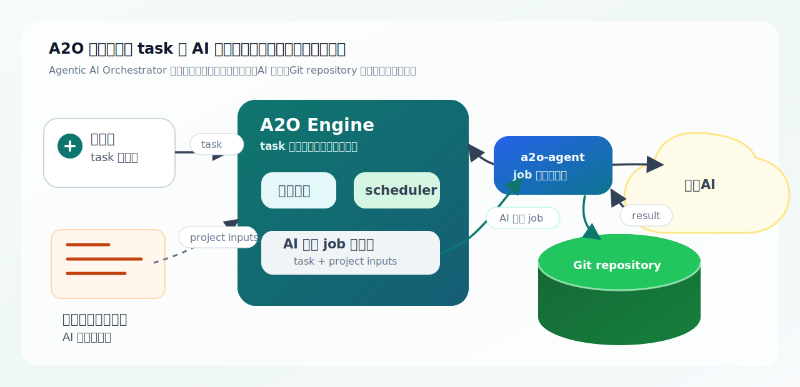

# A2O Engine

A2O の正式名称は Agentic AI Orchestrator である。A2O はカンバン上のタスクを読み取り、作業用ワークスペース、エージェント実行、検証、マージ、証跡記録までを管理する自動化エンジンである。



この図は、利用者がカンバンタスクとプロジェクトパッケージを用意し、A2O Engine がタスクを選び、`a2o-agent` が生成AIとプロダクトのツールチェーンを使って Git リポジトリに変更を反映し、結果をカンバンと証跡に残す流れを表す。

## A2O が解決すること

A2O は、AI に実装を任せるために必要な周辺作業をランタイムとしてまとめる。

| 観点 | 内容 |
|---|---|
| 利用者が用意するもの | Git リポジトリ、プロジェクトパッケージ、AI 用スキル、カンバンタスク |
| A2O が進めること | タスクの取り込み、フェーズごとのジョブ作成、エージェント実行、検証、マージ |
| 結果が残る場所 | Git ブランチ / マージ結果、カンバンの状態 / コメント、証跡、エージェント成果物 |
| 利用者が確認するもの | ボードの状態、`watch-summary`、`describe-task`、Git の変更 |

## 通常の流れ

```text
カンバンタスク
  -> A2O Engine が実行可能なタスクを選ぶ
  -> project.yaml / スキルからフェーズごとのジョブを作る
  -> a2o-agent が生成AIとプロダクトのツールチェーンを使って実行する
  -> Git リポジトリに変更が残る
  -> カンバンのコメント / 状態 / 証跡に結果が残る
```

この関係を先に理解するには [docs/ja/user/00-overview.md](docs/ja/user/00-overview.md) を読む。

## 方針

- A2O は、同梱されたカンバンサービスと `a2o-agent` を前提にしたランタイムとして扱う。
- A2O Engine は、タスクの進行管理、状態管理、カンバン連携、エージェント制御、証跡管理を担当する。
- プロダクト固有のツールチェーンはランタイムイメージに組み込まず、ホストまたは開発環境に置いた `a2o-agent` が実行する。
- プロダクト固有の知識はプロジェクトパッケージで宣言し、Engine コアへ埋め込まない。
- コア機能の検証は `reference-products/` にある小さな複数プロダクトで行う。

## 読み順

利用者向けドキュメント:

1. [docs/ja/user/00-overview.md](docs/ja/user/00-overview.md)
2. [docs/ja/user/10-quickstart.md](docs/ja/user/10-quickstart.md)
3. [docs/ja/user/20-project-package.md](docs/ja/user/20-project-package.md)
4. [docs/ja/user/30-operating-runtime.md](docs/ja/user/30-operating-runtime.md)
5. [docs/ja/user/40-troubleshooting.md](docs/ja/user/40-troubleshooting.md)
6. [docs/ja/user/50-parent-child-task-flow.md](docs/ja/user/50-parent-child-task-flow.md)
7. [docs/ja/user/80-current-release-surface.md](docs/ja/user/80-current-release-surface.md)
8. [docs/ja/user/90-project-package-schema.md](docs/ja/user/90-project-package-schema.md)
9. [docs/ja/user/95-runtime-naming-boundary.md](docs/ja/user/95-runtime-naming-boundary.md)

開発者向けドキュメント:

1. [docs/ja/dev/00-architecture.md](docs/ja/dev/00-architecture.md)
2. [docs/ja/dev/10-engineering-rulebook.md](docs/ja/dev/10-engineering-rulebook.md)
3. [docs/ja/dev/20-bounded-context-and-language.md](docs/ja/dev/20-bounded-context-and-language.md)
4. [docs/ja/dev/30-core-domain-model.md](docs/ja/dev/30-core-domain-model.md)
5. [docs/ja/dev/40-workspace-and-repo-slot-model.md](docs/ja/dev/40-workspace-and-repo-slot-model.md)
6. [docs/ja/dev/50-project-surface.md](docs/ja/dev/50-project-surface.md)
7. [docs/ja/dev/55-project-script-contract.md](docs/ja/dev/55-project-script-contract.md)
8. [docs/ja/dev/60-evidence-and-rerun-diagnosis.md](docs/ja/dev/60-evidence-and-rerun-diagnosis.md)
9. [docs/ja/dev/70-agent-worker-gateway-design.md](docs/ja/dev/70-agent-worker-gateway-design.md)
10. [docs/ja/dev/80-runtime-extension-boundary.md](docs/ja/dev/80-runtime-extension-boundary.md)
11. [docs/ja/dev/90-reference-product-suite.md](docs/ja/dev/90-reference-product-suite.md)
12. [docs/ja/dev/95-kanban-adapter-boundary.md](docs/ja/dev/95-kanban-adapter-boundary.md)

最小導入手順は [docs/ja/user/10-quickstart.md](docs/ja/user/10-quickstart.md) にまとめている。公開コマンドとランタイムイメージの範囲は [docs/ja/user/80-current-release-surface.md](docs/ja/user/80-current-release-surface.md) を参照する。
