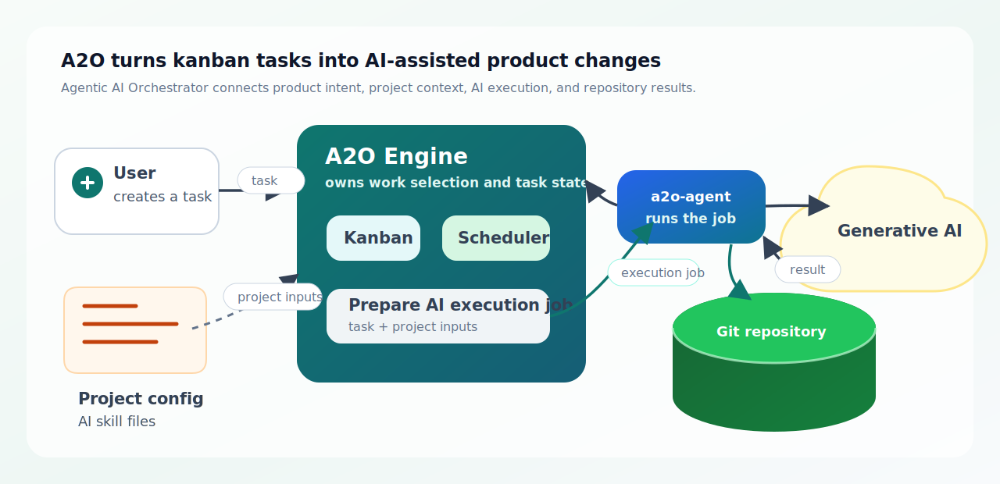

# A2O Engine

[Japanese README](README.ja.md)

A2O stands for Agentic AI Orchestrator. A2O is an automation engine that starts from kanban tasks and manages workspaces, agent execution, verification, merge, and evidence recording.



The diagram shows the normal flow: a user prepares kanban tasks and a project package, A2O Engine selects runnable work, `a2o-agent` runs Generative AI and the product toolchain, Git receives the resulting changes, and the kanban board and evidence store keep the outcome.

## What A2O Solves

A2O packages the work around AI-assisted implementation into a runtime.

| Area | Content |
|---|---|
| What users provide | Git repositories, a project package, AI skills, kanban tasks |
| What A2O runs | Task intake, phase job creation, agent execution, verification, merge |
| Where results remain | Git branches / merge results, kanban status / comments, evidence, agent artifacts |
| What users inspect | Board state, `watch-summary`, `describe-task`, Git changes |

## Normal Flow

```text
Kanban task
  -> A2O Engine selects runnable work
  -> project.yaml / skills define phase jobs
  -> a2o-agent runs Generative AI and the product toolchain
  -> changes are written to the Git repository
  -> comments, state, and evidence are recorded on the kanban side
```

Start with [docs/en/user/00-overview.md](docs/en/user/00-overview.md) to understand how these parts fit together.

## Requirement Decomposition

Use `trigger:investigate` for a high-level requirement that should be broken down before implementation. A2O treats that label as a decomposition request, not as an implementation request. The runtime scheduler started by `a2o runtime resume`, and each `a2o runtime run-once` cycle, automatically checks this decomposition queue before ordinary implementation work:

```text
Requirement ticket with trigger:investigate
  -> A2O investigates the request
  -> A2O proposes child tickets
  -> A2O reviews the proposal
  -> A2O creates a separate generated parent and draft child tickets with a2o:draft-child
  -> A2O moves the requirement ticket to Done
  -> a human edits / accepts the children by adding trigger:auto-implement
```

The source ticket does not need a `repo:*` scope label; repo labels belong on the generated or accepted implementation children. A2O treats the source ticket as a requirement artifact, not as the implementation parent. During decomposition A2O moves the source ticket through `In progress`, `In review`, and `Done`, then creates a separate generated parent ticket traceable from the requirement through the generated parent description and source-ticket comments, and parents draft children under that generated parent. `watch-summary` shows `trigger:investigate` source tickets in its `Decomposition` section even before evidence exists, and `runtime logs <task-ref>` falls back to decomposition status/evidence when the source ticket has no ordinary implementation log. The source ticket receives short comments as the investigate, propose, review, and child creation stages complete. The generated draft children are not runnable until a human accepts them with `trigger:auto-implement`. Configure this flow in `runtime.decomposition` and `runtime.prompts.decomposition` in the project package. See [docs/en/user/30-operating-runtime.md](docs/en/user/30-operating-runtime.md#requirement-decomposition) and [docs/en/user/90-project-package-schema.md](docs/en/user/90-project-package-schema.md#runtime-decomposition).

## Principles

- A2O is a local-first runtime that ships with bundled Kanbalone by default and can also connect to an external Kanbalone board.
- The Engine owns orchestration, state, the kanban adapter, the agent control plane, and evidence.
- Product-specific toolchains are not baked into the runtime image. They run through `a2o-agent` on the host or in a project dev environment.
- Product-specific knowledge belongs in the project package, not in Engine core.
- Core validation uses the small reference products under `reference-products/`.

## Reading Order

User documentation:

1. [docs/en/user/00-overview.md](docs/en/user/00-overview.md)
2. [docs/en/user/10-quickstart.md](docs/en/user/10-quickstart.md)
3. [docs/en/user/20-project-package.md](docs/en/user/20-project-package.md)
4. [docs/en/user/30-operating-runtime.md](docs/en/user/30-operating-runtime.md)
5. [docs/en/user/40-troubleshooting.md](docs/en/user/40-troubleshooting.md)
6. [docs/en/user/50-parent-child-task-flow.md](docs/en/user/50-parent-child-task-flow.md)
7. [docs/en/user/80-current-release-surface.md](docs/en/user/80-current-release-surface.md)
8. [docs/en/user/90-project-package-schema.md](docs/en/user/90-project-package-schema.md)
9. [docs/en/user/95-runtime-naming-boundary.md](docs/en/user/95-runtime-naming-boundary.md)

Developer documentation:

1. [docs/en/dev/00-architecture.md](docs/en/dev/00-architecture.md)
2. [docs/en/dev/10-engineering-rulebook.md](docs/en/dev/10-engineering-rulebook.md)
3. [docs/en/dev/20-bounded-context-and-language.md](docs/en/dev/20-bounded-context-and-language.md)
4. [docs/en/dev/30-core-domain-model.md](docs/en/dev/30-core-domain-model.md)
5. [docs/en/dev/40-workspace-and-repo-slot-model.md](docs/en/dev/40-workspace-and-repo-slot-model.md)
6. [docs/en/dev/50-project-surface.md](docs/en/dev/50-project-surface.md)
7. [docs/en/dev/55-project-script-contract.md](docs/en/dev/55-project-script-contract.md)
8. [docs/en/dev/60-evidence-and-rerun-diagnosis.md](docs/en/dev/60-evidence-and-rerun-diagnosis.md)
9. [docs/en/dev/70-agent-worker-gateway-design.md](docs/en/dev/70-agent-worker-gateway-design.md)
10. [docs/en/dev/80-runtime-extension-boundary.md](docs/en/dev/80-runtime-extension-boundary.md)
11. [docs/en/dev/90-reference-product-suite.md](docs/en/dev/90-reference-product-suite.md)
12. [docs/en/dev/95-kanban-adapter-boundary.md](docs/en/dev/95-kanban-adapter-boundary.md)

## Main Entrypoints

```sh
a2o version
a2o host install
a2o doctor
a2o upgrade check
a2o project template --with-skills --output ./project-package/project.yaml
a2o worker scaffold --language python --output ./project-package/commands/a2o-worker.py
a2o worker scaffold --language command --output ./project-package/commands/a2o-command-worker
a2o worker validate-result --request request.json --result result.json
a2o project bootstrap --package ./reference-products/typescript-api-web/project-package
a2o project lint --package ./reference-products/typescript-api-web/project-package
a2o project validate --package ./reference-products/typescript-api-web/project-package --config project-test.yaml
a2o kanban up
a2o kanban doctor
a2o kanban url
a2o agent target
a2o agent install --target auto --output ./.work/a2o/agent/bin/a2o-agent
a2o runtime up
a2o runtime run-once
a2o runtime run-once --project-config project-test.yaml
a2o runtime loop
a2o runtime resume
a2o runtime status
a2o runtime pause
a2o runtime down
a2o runtime image-digest
a2o runtime doctor
a2o runtime watch-summary
a2o runtime describe-task A2O#1
a2o runtime decomposition status A2O#1
a2o runtime decomposition cleanup A2O#1 --dry-run
a2o runtime reset-task A2O#1
a2o runtime skill-feedback list
a2o runtime skill-feedback propose --format ticket
a2o runtime show-artifact worker-run-1-implementation-combined-log
```

The runtime image still contains `bin/a3` as the internal Engine CLI. That is an implementation compatibility name. The public user-facing entrypoints are `a2o` and `a2o-agent`.

The quickest setup path is [docs/en/user/10-quickstart.md](docs/en/user/10-quickstart.md). For the published command surface and runtime image boundary, see [docs/en/user/80-current-release-surface.md](docs/en/user/80-current-release-surface.md).

## Repository Layout

- Engine core: `lib/a3/`, `bin/a3`, `spec/`
- Host launcher / agent: `agent-go/`
- Docker runtime assets: `docker/`
- Kanban tooling: `tools/kanban/`
- Reference product packages: `reference-products/`
- English user docs: [docs/en/user/](docs/en/user/)
- English developer docs: [docs/en/dev/](docs/en/dev/)
- Japanese docs: [docs/ja/](docs/ja/)

## Validation

The reference product suite covers four product shapes:

- `reference-products/typescript-api-web/`
- `reference-products/go-api-cli/`
- `reference-products/python-service/`
- `reference-products/multi-repo-fixture/`

Each product has a `project-package/` directory and can create a runtime instance with `a2o project bootstrap --package <package>`. See [docs/en/dev/90-reference-product-suite.md](docs/en/dev/90-reference-product-suite.md) for the suite purpose, package contract, and validation boundary.
