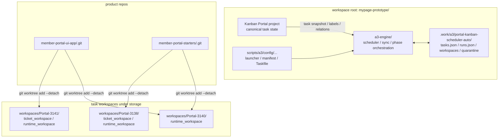
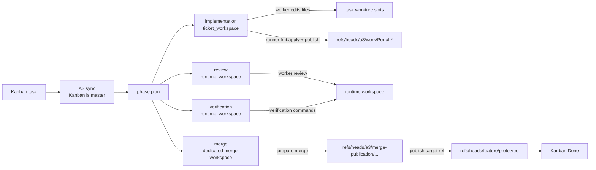
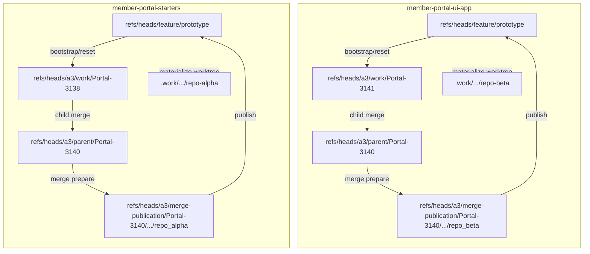
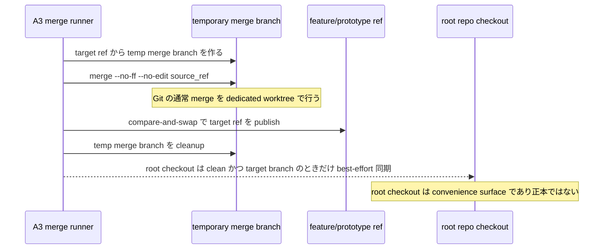

# A3 Repo / Worktree / Merge Model

対象読者: A3 設計者 / 実装者 / 運用者
文書種別: 設計メモ

この文書は、A3 が `workspace root`、product repo、task workspace をどう使い分けるかと、merge phase をどのモデルで扱うかをまとめて説明する。
特に、「どこが正本か」「A3 がどこで編集・review・verification・merge するか」「temporary merge branch を挟む理由は何か」「root repo checkout をどう位置付けるか」を現時点の設計として固定する。

## 1. 設計方針

- task state の正本は Kanban
- Git source の正本は product repo
- `tasks.json` / `runs.json` は運転用 state
- implementation は `ticket_workspace`、review / verification は `runtime_workspace`、merge は dedicated merge workspace を使う
- child 実装は `refs/heads/a3/work/*`、parent integration は `refs/heads/a3/parent/*` を使う
- merge publish は temporary merge branch で prepare し、target ref への publish を後段で行う
- root repo checkout は正本ではなく convenience surface として扱う

## 2. 全体構成

要点:

- Kanban が task state の正本
- `tasks.json` / `runs.json` は A3 の運転用 state
- `member-portal-ui-app` / `member-portal-starters` が source repo
- `.work/a3/.../workspaces/...` は task 実行用 worktree

## 3. Phase ごとの動き

要点:

- implementation は `ticket_workspace`
- review / verification は `runtime_workspace`
- merge は dedicated merge workspace
- child は `refs/heads/a3/work/...` を作る
- parent finalize は `refs/heads/a3/parent/...` を使う
- merge phase では target branch そのものではなく temporary merge branch を checkout する
- 最終的な publish target は product repo 側の target branch

## 4. Repo ごとに A3 が触る ref

要点:

- child task は repo slot ごとの `a3/work/...` を更新する
- parent task は child 統合済みの `a3/parent/...` を review / verify / merge する
- merge phase は target branch を直接 checkout せず、temporary merge branch 上で通常の `git merge` を行う
- target ref の更新は merge prepare 後の publish として扱う
- root repo 上で直接実装するのではなく、task workspace の worktree で進める

## 5. Merge model

Git には大きく 3 つの面がある。

- branch / `HEAD`
- `index`
- working tree

merge phase は、detached source からそのまま target ref を進めるのではなく、target ref から bootstrap した temporary merge branch を dedicated merge workspace で checkout して通常の `git merge` を行う。

### 5.1 Merge command

- merge workspace 上では通常の Git merge を行う
- 既定コマンドは `git merge --no-ff --no-edit <source_ref>`
- checkout failure / dirty tree は `blocked`
- conflict は recoverable class と non-recoverable class に分ける。recoverable conflict は dedicated merge workspace を保持し、AI-assisted `merge_recovery` へ進める。non-recoverable conflict または recovery policy 外の failure は `blocked` とする

### 5.1.1 AI-assisted merge recovery

merge recovery は通常 merge の置き換えではない。A3 はまず deterministic な Git merge を実行し、Git が conflict を検出した場合だけ AI worker を使って recovery を試す。

- trigger
  - `git merge` が content conflict で失敗した
  - merge workspace が clean target から作られており、未 publish の状態で保持できる
  - conflict file list が取得できる
- non-trigger
  - checkout failure
  - dirty tree
  - missing ref
  - partial publish / rollback failure
  - evidence 不整合
- worker input
  - conflict marker を含む merge workspace
  - target ref / source ref / before head / source head
  - conflict file list
  - merge log
  - task kind / repo slot / ownership / verification command summary
- worker constraints
  - conflict marker を解消する
  - 原則として conflict file だけを変更する
  - source と target の意図を両方残す
  - task 実装をやり直さない
  - unrelated formatting / cleanup を混ぜない
- publish guard
  - conflict marker scan が 0
  - changed files が conflict file list または explicit allowlist 内
  - `git status` が merge commit 作成可能な状態
  - recovery 後 verification が成功

recovery worker が失敗した場合、A3 は blocked とし、AI が作った差分を target ref へ publish しない。

### 5.2 Prepare / publish 分離

- `prepare`
  - 各 repo slot で temporary merge branch を作る
  - その branch 上で `git merge --no-ff --no-edit <source_ref>` を実行する
  - conflict した場合は publish せず、recoverable conflict なら `merge_recovery` candidate として workspace を保持する
  - merged head を記録する
- `publish`
  - 全 slot の prepare が成功した場合だけ target ref を compare-and-swap で更新する
  - 途中失敗時は rollback を試みる
  - rollback 失敗時は mixed target state を evidence に残して `blocked` とする

### 5.3 Dedicated merge workspace を使う理由

- target branch を直接 checkout しないことで branch exclusivity を避ける
- merge を Git の通常操作として扱える
- multi-repo merge を prepare / publish / rollback の publication protocol として扱える
- target ref の更新結果と merge evidence を対応づけやすい

## 6. Publish 完了条件

merge phase の成功条件は次のとおり。

- 全 repo slot の merge workspace 上で `git merge` が成功している
- 全 target ref が expected merged head を指している
- temporary merge branch と dedicated merge workspace の cleanup が成功している

厳密な cross-repo transaction は無いため、失敗時は rollback を試み、戻し切れなかった state を evidence に明示する。

## 7. Root repo checkout の位置付け

root repo checkout は authoritative state ではない。正本は次の 2 つである。

- target ref
- merge evidence

root repo checkout は operator convenience surface としてだけ扱う。
そのため、A3 が root repo を自動同期するのは次の条件を満たす場合に限る。

- root repo が target branch を checkout 中
- root repo が clean

条件を満たす場合だけ best-effort で target ref に追随させる。条件を満たさない場合は root repo を触らず、必要なら operator guidance を evidence に残す。

## 8. この文書の読み方

混乱しやすい点は次の 2 つである。

- A3 が正本として持つもの
  - task state の正本は Kanban
  - Git source の正本は product repo
  - merge publish の正本は target ref と merge evidence
- A3 が cache / execution surface として持つもの
  - `tasks.json` / `runs.json`
  - task workspace / runtime workspace
  - root repo checkout は convenience surface

この区別が崩れると、

- Kanban と internal state が食い違う
- root repo checkout を正本と誤解する
- rerun で stale artifact を拾う

といった問題が起きやすい。
