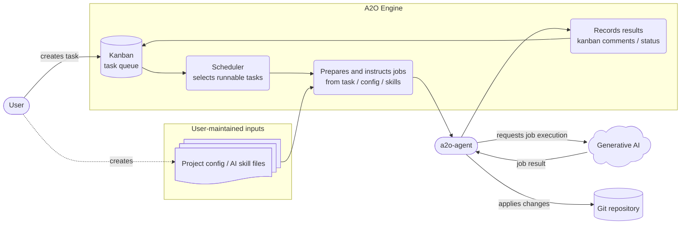

# A2O Architecture

This document explains how A2O Engine connects kanban, project packages, `a2o-agent`, Generative AI, and Git repositories to automate task work.

Use it as the entry point for the design documentation. Start with the overall runtime flow, then move to the detailed documents for the domain model, workspaces, agent boundary, kanban adapter, and other focused areas.

The goal is to understand A2O as a flow: select a task, create a job, delegate it to the agent, and record the result. Before making a design change, use this document to find the affected boundary, then read the matching detail document.

## Reading Path

Read this document first to understand runtime flow and responsibility boundaries. Then choose the next document based on the design surface you need.

| Topic | Next document |
| --- | --- |
| Everyday development decisions and review standards | [10-engineering-rulebook.md](10-engineering-rulebook.md) |
| A2O vocabulary and Bounded Context | [20-bounded-context-and-language.md](20-bounded-context-and-language.md) |
| Domain model for tasks, runs, phases, and evidence | [30-core-domain-model.md](30-core-domain-model.md) |
| Workspaces, repo slots, and branch namespace | [40-workspace-and-repo-slot-model.md](40-workspace-and-repo-slot-model.md) |
| Configuration surface exposed to project packages | [50-project-surface.md](50-project-surface.md) |
| Project command and worker contract | [55-project-script-contract.md](55-project-script-contract.md) |
| Evidence, blocked diagnosis, and reruns | [60-evidence-and-rerun-diagnosis.md](60-evidence-and-rerun-diagnosis.md) |
| Job boundary with `a2o-agent` | [70-agent-worker-gateway-design.md](70-agent-worker-gateway-design.md) |
| Boundary between core and project extensions | [80-runtime-extension-boundary.md](80-runtime-extension-boundary.md) |
| Validation through reference products | [90-reference-product-suite.md](90-reference-product-suite.md) |
| Release publish latency and distribution boundary | [98-release-publish-latency-and-distribution-build.md](98-release-publish-latency-and-distribution-build.md) |
| Kanban adapter and Kanbalone boundary | [95-kanban-adapter-boundary.md](95-kanban-adapter-boundary.md) |

## Runtime Flow

A2O is a runtime that turns kanban tasks into AI-executable jobs and keeps the path through verification and merge traceable.

1. A user prepares a project package and kanban task.
2. The scheduler selects a runnable task from kanban current tasks, excludes `Resolved` / `Archived`, applies parent-child and blocker gating, then picks the highest-priority runnable candidate.
3. Engine builds a phase job from the task, `project.yaml`, skills, and repo slots.
4. `a2o-agent` runs execution commands on the host or in the development environment.
5. The execution commands use Generative AI and the product toolchain to create changes.
6. Engine manages verification, merge, evidence, and kanban state.

The supporting boundaries are deliberately separate. The domain model owns the task lifecycle. The workspace model owns source and branch materialization. The agent boundary owns external command execution. The kanban adapter owns the task state visible to users.

The scheduler contract is part of the architecture, not an incidental implementation detail.

- Kanban is the source of truth for the current task set.
- `Done` remains part of the current board view until a human resolves it.
- `Resolved` and `Archived` are outside scheduler selection and watch-summary.
- Unresolved kanban blockers prevent runnable selection.
- Parent/child gating and sibling ordering apply in addition to blocker gating.
- Runnable candidates are ordered by kanban priority first and task ref second.

## System Overview

In normal operation, the user creates kanban tasks and project inputs. The resident scheduler selects runnable tasks from Engine-managed kanban state. Engine combines the task, project configuration, and AI skill files into AI execution jobs. `a2o-agent` runs the jobs on the host or in the project's development environment, asks Generative AI to perform the job, and applies the result to the Git repository. Engine records task state, comments, and evidence back to kanban.

## Responsibility Boundaries

- A2O Engine: task lifecycle, scheduler, phase progression, kanban adapters, evidence, and merge progression.
- Project package: project-specific repo slots, labels, skills, execution commands, verification / remediation commands, and merge defaults.
- `a2o-agent`: command execution in the product environment, workspace materialization, and artifact publication.
- Generative AI: implementation and review assistance requested by execution commands.
- Git repository: durable artifact for AI execution results and merge results.

## Task Lifecycle

| State | Meaning | Primary owner |
| --- | --- | --- |
| `To do` | Candidate that the scheduler can import | Kanban / Engine |
| `In progress` | Implementation or runtime phase is active | Engine |
| `In review` | Review or confirmation stage | Engine / agent job |
| `Inspection` | Stage for inspecting verification results or parent-child integration decisions | Engine |
| `Merging` | Source is being integrated into the target ref | Engine / Git workspace |
| `Done` | A2O automation has completed | Engine / kanban |
| `Blocked` | Operator action is required | Engine / operator |

Kanban lanes are user-visible state. Domain objects hold the task state, current run, phase, and terminal outcome that Engine uses for scheduling and transition decisions.

## Phases And Responsibilities

| Phase | Purpose | Main input | Main output |
| --- | --- | --- | --- |
| `implementation` | Create changes | Task, skills, repo slots | Work branch, agent artifacts |
| `review` | Inspect implementation results | Source descriptor, review skills | Review decision, evidence |
| `parent_review` | Decide how child task results integrate | Parent task scope, child task outputs | Parent task evidence |
| `verification` | Run deterministic verification | Workspace, verification commands | Success / failure evidence |
| `remediation` | Try deterministic repair | Failed verification context | Formatted / repaired workspace |
| `merge` | Integrate into the target ref | Source ref, target ref, merge policy | Merge result, kanban update |

## Data Ownership

| Data | Owner | Use |
| --- | --- | --- |
| Kanban tasks / lanes / comments | Kanban adapter | User-visible queue and state |
| Runtime tasks / run state | A2O Engine | Scheduler and phase transition decisions |
| Project package | User / product team | Declares repo slots, skills, commands, and verification |
| Agent workspace / artifacts | `a2o-agent` | Product-environment execution results and logs |
| Git branches / merge results | Git repository | Final artifacts and integration results |
| Evidence / blocked diagnosis | A2O Engine | Investigation of failed or completed runs |

## Document Index

### 0. User Path

- [../user/00-overview.md](../user/00-overview.md)
- [../user/10-quickstart.md](../user/10-quickstart.md)

Entry point for understanding, installing, and operating A2O.

### 1. Engineering Discipline

- [10-engineering-rulebook.md](10-engineering-rulebook.md)

Sets the rules for immutability, TDD, refactoring, and not avoiding necessary fixes.

### 2. Language And Bounded Context

- [20-bounded-context-and-language.md](20-bounded-context-and-language.md)

Fixes terms such as task kind, phase, workspace, repo slot, and evidence.

### 3. Core Domain Model

- [30-core-domain-model.md](30-core-domain-model.md)

Covers aggregates, entities, value objects, and state transitions.

### 4. Workspace / Repo Slot / Lifecycle

- [40-workspace-and-repo-slot-model.md](40-workspace-and-repo-slot-model.md)

Covers fixed repo slots, synchronization, freshness, retention, garbage collection, and merge workspaces.

### 5. Project Configuration Surface

- [50-project-surface.md](50-project-surface.md)
- [55-project-script-contract.md](55-project-script-contract.md)
- [../user/90-project-package-schema.md](../user/90-project-package-schema.md)
- [80-runtime-extension-boundary.md](80-runtime-extension-boundary.md)

Covers the project package schema, project script contract, repo slots, verification, and initialization hook boundaries.

### 6. Evidence / Rerun / Blocked Diagnosis

- [60-evidence-and-rerun-diagnosis.md](60-evidence-and-rerun-diagnosis.md)

Covers internal evidence that supports reproducible review, merge, rerun, and blocked-run investigation.

### 7. Runtime Distribution

- [../user/30-operating-runtime.md](../user/30-operating-runtime.md)
- [70-agent-worker-gateway-design.md](70-agent-worker-gateway-design.md)
- [../user/95-runtime-naming-boundary.md](../user/95-runtime-naming-boundary.md)

Covers the Docker runtime image, host launcher, bundled kanban service, agent boundary, and internal compatibility names.

### 8. Reference Validation

- [90-reference-product-suite.md](90-reference-product-suite.md)

Covers sample products and validation boundaries used by core verification.

### 9. Current Release Surface

- [../user/80-current-release-surface.md](../user/80-current-release-surface.md)

Summarizes the supported public surface and validation boundary for A2O 0.5.17.

### 10. Kanban Adapter Boundary

- [95-kanban-adapter-boundary.md](95-kanban-adapter-boundary.md)

Covers the kanban command contract and adapter boundary.

## Find By Question

| Question | Read |
| --- | --- |
| How do task / run / phase states transition? | [30-core-domain-model.md](30-core-domain-model.md) |
| How are workspaces and branches created? | [40-workspace-and-repo-slot-model.md](40-workspace-and-repo-slot-model.md) |
| What can Engine read from a project package? | [50-project-surface.md](50-project-surface.md) |
| What contract do project scripts follow? | [55-project-script-contract.md](55-project-script-contract.md) |
| How are agent jobs handed off? | [70-agent-worker-gateway-design.md](70-agent-worker-gateway-design.md) |
| What evidence exists when a task is blocked? | [60-evidence-and-rerun-diagnosis.md](60-evidence-and-rerun-diagnosis.md) |
| What is the kanban adapter responsible for? | [95-kanban-adapter-boundary.md](95-kanban-adapter-boundary.md) |
