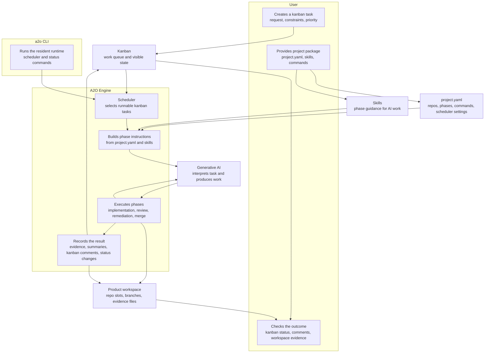

# A2O Design Map

This document explains what each design document covers and the recommended reading order.

## Goals

- Keep domain, application, infrastructure, and project surface responsibilities separate.
- Keep product-specific rescue branches and workspace assumptions out of Engine core.
- Make the boundary between public A2O surfaces and internal compatibility names explicit.
- Treat the reference product suite as the canonical core validation target.

## Architecture Overview

In normal use, the user creates a kanban task and keeps the project package up to date. The resident scheduler picks runnable tasks from kanban. The Engine reads `project.yaml` for the project structure and executable phase commands, reads skills for phase guidance, asks Generative AI to perform the work, and records the outcome as workspace evidence and kanban-visible status.

## Documents

### 0. User Path

- [../user/00-user-quickstart.md](../user/00-user-quickstart.md)

The user manual for installing and operating A2O.

### 1. Engineering Discipline

- [10-engineering-rulebook.md](10-engineering-rulebook.md)

Rules for immutability, TDD, refactoring, and avoiding shortcut fixes.

### 2. Language and Bounded Contexts

- [20-bounded-context-and-language.md](20-bounded-context-and-language.md)

Defines task kind, phase, workspace, repo slot, evidence, and other core vocabulary.

### 3. Core Domain Model

- [30-core-domain-model.md](30-core-domain-model.md)

Defines aggregates, entities, value objects, and state transitions.

### 4. Workspace / Repo Slot / Lifecycle

- [40-workspace-and-repo-slot-model.md](40-workspace-and-repo-slot-model.md)

Defines fixed repo slots, synchronization, freshness, retention, garbage collection, and merge workspaces.

### 5. Project Surface

- [50-project-surface.md](50-project-surface.md)
- [55-project-script-contract.md](55-project-script-contract.md)
- [../user/10-project-package-schema.md](../user/10-project-package-schema.md)
- [80-runtime-extension-boundary.md](80-runtime-extension-boundary.md)

Defines the project package schema, project script contract, repo slots, verification, and extension boundaries.

### 6. Evidence / Rerun / Blocked Diagnosis

- [60-evidence-and-rerun-diagnosis.md](60-evidence-and-rerun-diagnosis.md)

Defines the internal evidence model for review, merge, rerun, and blocked-run diagnosis.

### 7. Runtime Distribution

- [../user/20-runtime-distribution.md](../user/20-runtime-distribution.md)
- [70-agent-worker-gateway-design.md](70-agent-worker-gateway-design.md)
- [../user/30-runtime-naming-boundary.md](../user/30-runtime-naming-boundary.md)

Defines the Docker runtime image, host launcher, bundled kanban service, agent gateway, and internal compatibility names.

### 8. Reference Validation

- [90-reference-product-suite.md](90-reference-product-suite.md)

Defines the sample products and the release validation scope.

### 9. Release Status

- [../user/40-release-status.md](../user/40-release-status.md)

Summarizes the public surface and validation status for A2O 0.5.2.

### 10. Kanban Adapter Boundary

- [95-kanban-adapter-boundary.md](95-kanban-adapter-boundary.md)

Defines the current kanban command contract and the adapter boundary for future native implementations.
