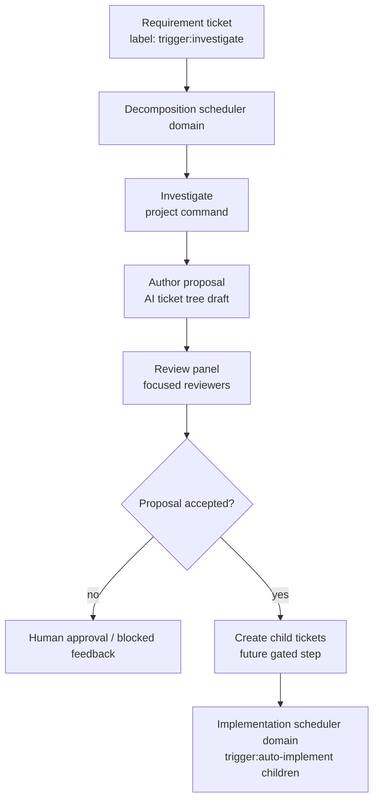

# Ticket Decomposition MVP

This document defines the MVP design for automated ticket decomposition, tracked by A2O#225 and GitHub issue #15.

The feature turns a high-level requirement ticket into a reviewed child-ticket proposal before implementation starts. The first release must prove the scheduling and review shape without making ticket creation or implementation unsafe.

## Problem

Today A2O executes already-scoped kanban tasks. When a user creates a large requirement ticket, the work of investigation, decomposition, child-ticket creation, and implementation planning still depends on one-off human or agent prompting.

That creates two failure modes:

- large tickets enter implementation before their boundaries and dependencies are understood
- implementation work can occupy runtime attention while ticket decomposition work waits, even though the two activities can proceed independently

The MVP must therefore introduce decomposition as its own runtime concern, not as a disguised implementation phase.

## Goals

- Detect high-level requirement tickets marked with `trigger:investigate`.
- Run a project-owned investigation command to collect product-specific context.
- Produce a proposed ticket tree with child scopes, dependencies, labels, verification expectations, and acceptance criteria.
- Review the proposal with multiple focused reviewer perspectives before any automated creation.
- Keep decomposition scheduling independent from implementation scheduling.
- Limit the first implementation to one active decomposition pipeline per project.

## Non-Goals

- A2O does not bundle static analysis, repository mining, or product-specific investigation tools.
- The MVP does not require parallel creation of multiple ticket trees.
- The MVP does not automatically implement generated child tickets.
- The MVP does not overload existing `Task.kind` values such as `single`, `parent`, or `child`.
- The MVP does not force decomposition through the existing `implementation` phase.

## Scheduling Boundary

Decomposition and implementation must be separate scheduler domains.

| Domain | Trigger | Work it owns | Concurrency |
| --- | --- | --- | --- |
| implementation | ordinary runnable A2O task state | implementation, review, verification, remediation, merge, parent review | existing implementation runtime policy |
| decomposition | `trigger:investigate` on a high-level ticket | investigate, author proposal, proposal review, optional gated child creation | one active pipeline per project in the MVP |

The important invariant is:

> An active implementation task must not prevent a `trigger:investigate` ticket from advancing, and an active decomposition pipeline must not prevent ordinary implementation tasks from advancing.

The two domains may share the kanban adapter, project package, repo slots, and evidence store, but they need separate runnable queues and separate active-run locks. Implementation `max_steps`, phase state, and worker occupancy must not be reused as the gate for decomposition. Decomposition `max_steps` or proposal review state must likewise not gate implementation selection.

Ticket creation itself does not need parallel execution in the MVP. Keeping a single decomposition pipeline avoids duplicate child tickets, lowers review cost, and makes idempotency simpler while still allowing implementation work to continue.

## Runtime Flow



The MVP can stop at a reviewed proposal. Automated child-ticket creation is a follow-up step behind an explicit gate until the proposal format, review result, and duplicate-prevention behavior are proven.

## Investigation Command Contract

Investigation is project-owned. A2O provides the lifecycle, request, result validation, evidence retention, and kanban updates.

The project package should declare a command such as:

```yaml
runtime:
  decomposition:
    investigate:
      command: ["./commands/investigate.sh"]
```

The exact schema can evolve, but the public contract should follow the existing project-script style:

- A2O passes a JSON request path through an `A2O_*` environment variable.
- The command writes one JSON result to an `A2O_*` result path.
- Scripts read repo paths from declared slot paths instead of private runtime files.
- Non-zero exit or invalid JSON blocks the decomposition pipeline with evidence.

The request should include:

- source ticket ref, title, description, labels, and priority
- source ticket parent/child/blocker relations
- repo slot aliases and workspace paths
- project package metadata relevant to implementation and verification
- allowed repo labels and supported task kinds
- previous decomposition evidence for reruns, if present

The result should include:

- summary of the requirement and product context
- affected modules, files, commands, APIs, schemas, and external systems
- known dependencies and ordering constraints
- risk areas and confidence
- suggested ticket boundaries
- open questions that should block automatic creation
- evidence links or artifact paths

## Author Proposal Contract

The author step converts investigation evidence into a normalized proposal. It should not create tickets directly.

The proposal should contain:

- source ticket ref and proposal fingerprint
- proposed parent update, if the source ticket should become the parent
- child ticket drafts with title, body, acceptance criteria, labels, priority, and verification level
- dependency graph between proposed children
- expected blocker relations
- expected parent/child relations
- suggested `trigger:auto-implement` usage
- rationale for each child boundary
- unresolved questions and required human decisions

The proposal fingerprint is required for idempotency. It should be derived from the source ticket ref, source revision fields, investigation result digest, and ordered child draft content.

## Review Panel

The MVP review panel may run reviewers sequentially. The key design point is independent reviewer responsibility, not parallel execution.

Recommended reviewer scopes:

- architecture reviewer: checks boundaries, repo labels, and dependency direction
- planning reviewer: checks child granularity, blocker graph, and implementation order
- verification reviewer: checks acceptance criteria and deterministic validation expectations

Any critical finding blocks automatic child creation. Findings are stored with the proposal evidence and posted back to the source ticket. A clean review means the proposal is eligible for the next configured gate; it does not imply implementation should start without created child tickets.

## Kanban Creation Boundary

Automated creation should be a later gated step after proposal-only mode is stable.

When enabled, creation must use the kanban adapter boundary rather than provider-specific calls scattered through orchestration code. It should reuse or generalize the current child-ticket writer behavior so multiline descriptions, labels, parent relations, blocker relations, and comments follow the existing command contract.

Creation must be idempotent:

- store the proposal fingerprint on the source ticket evidence or comment
- detect already-created child tickets for that fingerprint
- avoid creating duplicates on rerun
- record created ticket refs, relation results, and failed writes

Generated implementation children should receive `trigger:auto-implement` only after the proposal gate allows them to enter the implementation scheduler domain.

## Evidence And Status

Decomposition runs should publish evidence separately from implementation runs.

Minimum evidence:

- investigation request and result
- author proposal
- reviewer findings and final disposition
- proposal fingerprint
- child creation result, when enabled
- blocked reason and next operator action

Runtime status and future watch-summary output should be able to show both domains. The normal implementation task tree should not need to pretend that decomposition is a child implementation task.

## Rollout Plan

1. Document the design, schema direction, and scheduler invariants.
2. Add proposal-only runtime support for `trigger:investigate`.
3. Add project-package validation for the investigation command declaration.
4. Add review-panel evidence and blocking disposition.
5. Add human-approved child-ticket creation.
6. Consider fully automated child creation only after duplicate prevention and review quality are proven.

## Validation Requirements

Future implementation should include tests for:

- implementation scheduler work does not block decomposition runnable selection
- decomposition active lock does not block implementation runnable selection
- only one decomposition pipeline can be active per project in the MVP
- invalid investigation output blocks with actionable evidence
- proposal review findings prevent child-ticket creation
- child-ticket creation is idempotent across reruns
- generated children keep parent, blocker, label, and `trigger:auto-implement` relations

The reference product suite should include one requirement ticket that decomposes into multiple implementation tickets with at least one explicit dependency.
