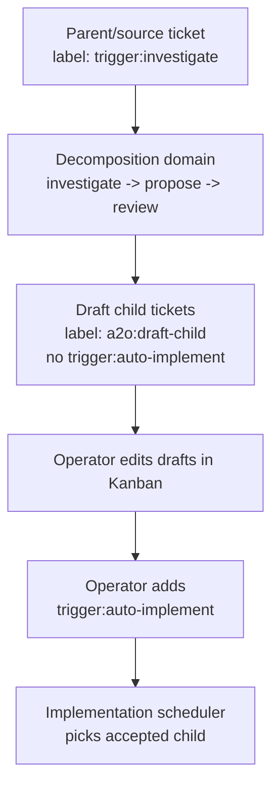

# Kanban-First Decomposition Drafts

This document details the A2O#356 follow-up to the ticket decomposition MVP in [75-ticket-decomposition-mvp.md](75-ticket-decomposition-mvp.md).

The MVP proves that `trigger:investigate` can run investigation, proposal authoring, and proposal review outside the ordinary implementation scheduler. A2O#356 changes the operator experience after an eligible proposal review: A2O should create draft child tickets in Kanban early, then let the operator edit and accept those children directly on the board.

## 1. Problem

The current decomposition flow is command-oriented:

1. run investigation
2. author a proposal
3. review the proposal
4. run gated child creation

That is safe, but it keeps too much of the planning loop outside Kanban. Operators want to see proposed children as real Kanban tickets, edit their title/body/labels/order there, and approve individual children without running a separate technical workflow.

## 2. Goals

- Treat `trigger:investigate` as the Kanban-first entry point for decomposition.
- After an eligible proposal review, automatically create or reconcile child tickets as drafts.
- Keep draft children non-runnable until an operator explicitly accepts them.
- Preserve operator edits during decomposition reruns.
- Keep child creation idempotent across proposal reruns and partial failures.
- Support remote source tickets from the A2O#286 flow without forcing implementation to start.
- Keep the implementation scheduler contract simple: `trigger:auto-implement` is still the runnable gate.

## 3. Non-Goals

- Do not require a separate explicit accept command for the primary flow.
- Do not automatically add `trigger:auto-implement` to decomposition-created draft children.
- Do not overwrite human-edited child ticket title, body, labels, priority, or ordering on rerun.
- Do not run implementation from `a2o:draft-child` alone.
- Do not make multiple decomposition pipelines active per project in this feature.

## 4. Operator Flow

The primary acceptance action is ordinary Kanban editing. A child becomes runnable when a human adds `trigger:auto-implement` to that child. Removing `a2o:draft-child` is optional metadata cleanup, not the scheduler gate.

An optional helper command may convert draft children in bulk, but it is only a convenience layer. It must not be required for the MVP user path.

## 5. Label And State Contract

| Label | Owner | Meaning |
| --- | --- | --- |
| `trigger:investigate` | operator | Source ticket should enter the decomposition scheduler domain. |
| `a2o:decomposed` | A2O | Source ticket has at least one successful draft-child creation or reconciliation result for the current proposal lineage. The generated implementation parent also receives this label. |
| `a2o:draft-child` | A2O | Child ticket was generated from a decomposition proposal and is still a draft for planning purposes. |
| `trigger:auto-implement` | operator or helper | Child is accepted and may enter the implementation scheduler domain. |
| `a2o:ready-child` | optional operator convention | Selection helper for a future bulk accept command; it is not a scheduler gate. |
| `trigger:auto-parent` | operator, helper, or project policy after child acceptance | Parent automation is explicitly requested. It is not added by draft creation, but the A2O#286 remote issue flow needs a path to add it after accepted children become runnable. |

The scheduler must continue to use `trigger:auto-implement` as the implementation gate. A ticket with `a2o:draft-child` and no `trigger:auto-implement` is visible in Kanban but non-runnable.

If a rerun sees an existing draft child that already has `trigger:auto-implement`, it must preserve that label and treat the child as accepted by the operator.

## 6. Draft Child Reconciliation

Draft creation is a reconciliation operation, not an append-only creation step.

Each proposal contains:

- a proposal fingerprint
- stable child idempotency keys
- proposed parent relation
- proposed blocker relations
- proposed labels and verification expectations

The writer finds existing children by child key, not by mutable title alone. The child key must be stored in a durable, readable location such as the generated metadata block in the description, an A2O comment, or evidence. If multiple tickets claim the same child key, A2O must block with a clear diagnostic instead of guessing.

On first creation, A2O writes the proposed title/body/acceptance criteria, `a2o:draft-child`, child key, proposal fingerprint, parent relation, blocker relations, and an audit comment.
The Kanban-first draft writer must filter proposal labels before applying them to the child ticket: `trigger:auto-implement` is never copied from the proposal into a draft child.
If the proposal suggests implementation eligibility, A2O records that suggestion in evidence or an audit comment only.

On rerun, A2O may ensure missing A2O-owned metadata, draft-safe labels, comments, and relations.
`trigger:auto-implement` is not an A2O-owned label in draft mode and must not be restored or added by reconciliation.
If the label is already present, reconciliation preserves it as an operator or helper acceptance decision.
It must not replace user-editable content by default:

- title
- body or description outside the A2O metadata block
- acceptance criteria text
- priority
- manually added labels
- manually removed non-required labels
- human ordering decisions

If the new proposal differs from the existing edited child, A2O records drift evidence on the parent/source ticket and in child-creation evidence. It does not silently overwrite the ticket.

## 7. Automatic Decomposition Stage

A2O#356 adds an automatic draft creation stage after an eligible proposal review.

An eligible proposal review means the review disposition allows child draft creation to proceed. It does not require zero reviewer findings; non-blocking findings, notes, or follow-up recommendations may exist as long as the final review disposition is eligible.

The decomposition scheduler should be able to advance this sequence without an operator running each command manually:

1. select a `trigger:investigate` source ticket
2. run investigation when needed
3. author a proposal when needed
4. review the proposal when needed
5. create or reconcile draft children when the review disposition is eligible
6. record evidence and post a concise Kanban audit comment

The implementation scheduler remains independent. Draft creation must not wait for implementation worker idleness, and ordinary implementation tasks must not wait for draft creation except through normal Kanban blocker relations.

The existing manual `create-children --gate` path may remain for compatibility, but the Kanban-first automatic path must default to draft children with no `trigger:auto-implement`.

## 8. Evidence And Audit

The parent/source ticket evidence should include:

- source ticket ref and source revision fields used for the proposal
- investigation evidence path
- proposal evidence path and proposal fingerprint
- review disposition
- draft child refs keyed by child key
- relation results
- reconciliation actions
- drift diagnostics
- blocked reason, when reconciliation cannot continue

Each decomposition stage must leave a short source-ticket comment when it completes. The required stage comments are:

- investigation completed or blocked
- proposal authored or blocked
- proposal review completed, including whether the disposition is eligible for draft creation
- draft child creation or reconciliation completed or blocked

Kanban comments should be short and user-actionable. They should summarize the stage outcome, point to evidence when useful, and say which child drafts were created or reconciled and how to accept them. Detailed JSON belongs in evidence.

Child tickets should include enough metadata for operators and reruns:

- source ticket ref
- proposal fingerprint
- child key
- draft status
- suggested dependency notes

## 9. Remote Source Ticket Boundary

For remote issue intake from A2O#286, the remote issue can be the source ticket that receives `trigger:investigate`. Draft children are still Kanban planning artifacts and must not become runnable until accepted with `trigger:auto-implement`.

Draft creation must not add `trigger:auto-parent` to the source ticket. That would make the remote issue parent runnable before the operator has accepted any child implementation work.

After one or more draft children are accepted and receive `trigger:auto-implement`, the workflow needs a parent-automation path for the generated implementation parent. That path may be a manual operator label, a helper command, or explicit project policy, but it happens after child acceptance rather than during draft creation. When it is applied, the generated parent receives `trigger:auto-parent` so the A2O#286 parent flow can observe accepted child delivery work. The original requirement source ticket stays a requirement artifact rather than the runnable implementation parent.

The implementation should avoid provider-specific logic in orchestration. Remote/local differences belong behind the kanban adapter and child writer boundary. If the adapter cannot create provider-backed children, A2O may create local Kanban children linked to the remote source and record that mapping in evidence.

## 10. Optional Accept-Drafts Helper

The optional helper from A2O#357 should only mutate existing draft children. It must not create new tickets.

The helper should:

- select explicit children or a deliberately marked set such as `a2o:ready-child`
- add `trigger:auto-implement`
- optionally remove `a2o:draft-child`
- leave title, body, relations, and ordering untouched
- be idempotent

Direct manual label editing remains the primary acceptance path.

## 11. Validation Requirements

Implementation should include tests for:

- `a2o:draft-child` without `trigger:auto-implement` is not runnable
- automatic decomposition creates draft children after an eligible proposal review
- draft creation does not add `trigger:auto-implement`
- rerun finds existing children by child key
- rerun preserves human edits and accepted children
- partial child creation is reconciled without duplicates
- duplicate child keys block with an actionable diagnostic
- source evidence records the generated parent ref plus created and reconciled draft refs
- remote-source decomposition creates non-runnable draft children through the adapter boundary
- remote-source requirement does not receive `trigger:auto-parent` during draft creation; the generated parent has a tested path to receive it after child acceptance
- optional accept-drafts conversion changes only labels

## 12. Ticket Split

The implementation should be split by the design sections above:

- Sections 5 and 6: draft child writer and reconciliation behavior.
- Section 7: automatic scheduler stage from eligible proposal review to draft reconciliation.
- Section 8: evidence and audit comments.
- Section 9: remote source ticket boundary.
- Section 10: optional accept-drafts helper.
- Section 11: end-to-end and scheduler validation.
