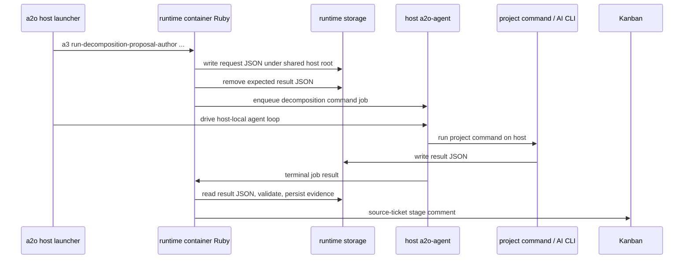

# Host-Agent Decomposition Command Protocol

This document defines the design for A2O#411: project-owned decomposition commands must be able to call host-only AI worker CLIs such as Copilot while preserving the current decomposition request/result contract.

## Problem

`a2o runtime decomposition investigate`, `propose`, and `review` are host-launcher commands, but today they execute the runtime Ruby command through `docker compose exec`. The Ruby decomposition applications then run `runtime.decomposition.*.command` with `Open3` inside the runtime container.

That topology fails when the project command needs a host-only CLI, credential store, shell profile, browser integration, or user-local agent configuration. It also differs from ordinary runtime phases, where project execution is delegated through the host agent boundary.

## Goals

- Run project-owned decomposition commands through `a2o-agent` on the host.
- Keep the existing project package command schema and `A2O_DECOMPOSITION_*_REQUEST_PATH` / `A2O_DECOMPOSITION_*_RESULT_PATH` contract.
- Preserve decomposition evidence, source-ticket comments, validation, and Kanban behavior in the runtime container.
- Support `investigate`, `propose`, and `review` with one shared execution protocol.
- Keep `create-children`, `status`, and `cleanup` container-local because they are runtime storage / Kanban operations, not project AI-worker commands.
- Fail with actionable diagnostics when the host agent path is unavailable.

## Non-Goals

- Running arbitrary project commands directly from the Go launcher.
- Making decomposition commands mutate implementation workspaces.
- Replacing the existing implementation/review/verification agent protocol.
- Allowing remote, non-local agents in this hotfix path.

## Protocol Shape

The runtime container remains the decomposition orchestrator. It creates request JSON, validates result JSON, persists evidence, and posts source-ticket comments. Only the project-owned command execution step is delegated to the host agent.



## Shared Path Contract

The command request and result files must live under a path visible to both the runtime container and the host agent. The host launcher already resolves a host root as `plan.HostRootDir`, mounted in the runtime container as `/workspace`.

For host-agent decomposition, the runtime command must receive both forms:

- `--host-shared-root <host path>`
- `--container-shared-root /workspace`

The Ruby decomposition application writes request/result files under the container path but records the paired host path in the agent job environment. Example for proposal authoring:

- Container request path: `/workspace/.work/a2o/decomposition-workspaces/<task>/.../decomposition-proposal-request.json`
- Host request path: `<host-root>/.work/a2o/decomposition-workspaces/<task>/.../decomposition-proposal-request.json`

The project command receives host paths in environment variables:

- `A2O_DECOMPOSITION_REQUEST_PATH`
- `A2O_DECOMPOSITION_RESULT_PATH`
- `A2O_DECOMPOSITION_AUTHOR_REQUEST_PATH`
- `A2O_DECOMPOSITION_AUTHOR_RESULT_PATH`
- `A2O_DECOMPOSITION_REVIEW_REQUEST_PATH`
- `A2O_DECOMPOSITION_REVIEW_RESULT_PATH`
- `A2O_WORKSPACE_ROOT`
- `A2O_ROOT_DIR`

Container paths must not be exposed to the host command unless they are also valid host paths.

This rule applies to both environment variables and JSON payload contents. Decomposition request JSON currently contains path fields such as workspace roots, slot paths, artifact paths, and evidence paths. A host-agent command must not receive container-only `/workspace/...` values in those fields unless the same string is valid on the host. The implementation must either:

- rewrite every project-visible path in the request JSON to its host path before the host command reads it, while keeping a container-path copy for runtime-internal evidence handling; or
- include paired fields, for example `path` / `container_path` or `host_path` / `container_path`, and define that project commands read the host path field.

The preferred hotfix behavior is host-path rewriting for project-visible request files because it preserves the existing simple script contract. Runtime-owned evidence records may still store container paths when those paths are never exposed to project commands.

## Job Boundary

Introduce a decomposition command runner adapter in Ruby. It should present the same small interface as the existing direct runner:

```ruby
call(command, chdir:, env:) -> [stdout, stderr, status]
```

The adapter enqueues an `AgentJobRequest` with:

- `phase`: `verification` for compatibility with current allowed agent job phases, plus `worker_protocol_request.command_intent = "decomposition_<stage>"`.
- `task_ref`: source ticket ref.
- `run_ref`: synthetic stable value such as `decomposition:<stage>:<task_ref>:<timestamp-or-request-id>`.
- `working_dir`: host workspace root for the decomposition trial.
- `command`: `sh`
- `args`: `["-lc", shell-joined project command]`
- `env`: host-path environment variables.
- `workspace_request`: `nil` for the first implementation. Decomposition already materializes its own disposable workspace under the shared root.
- `artifact_rules`: empty for MVP; stdout/stderr are carried through diagnostics.

The adapter waits for the job to complete and converts the agent result into the existing `[stdout, stderr, status]` tuple. Failed, timed out, cancelled, stale, enqueue failure, and fetch failure outcomes must become non-success status objects with useful stderr.

The agent worker must preserve stdout/stderr for decomposition command intents. Existing notification command diagnostics already carry stdout/stderr; decomposition should use the same diagnostic shape for `command_intent` values beginning with `decomposition_`.

The hotfix implementation should not add a first-class `decomposition` agent phase. The current agent job stores, status readers, and worker allow-list already understand `verification`, while `command_intent` is enough to distinguish decomposition jobs in diagnostics. A future cleanup can introduce a dedicated phase only after those read/write surfaces are updated together.

All worker-protocol surfaces that classify command intent must treat `decomposition_*` as a decomposition intent. That includes docs-context selection, diagnostics labeling, Ruby validation, and Go/agent-side allow-lists. If a specific surface intentionally does not need decomposition context, that exception must be explicit in code comments and tests; silent fallback to a generic verification intent is not acceptable.

## Host Launcher Lifecycle

The Go host launcher must provide the same local control-plane lifecycle used by `runtime run-once` before invoking container-side decomposition commands:

1. Build the runtime plan.
2. Ensure runtime container is up.
3. Ensure launcher config and host agent binary are available.
4. Start the runtime agent server.
5. Wait for the control plane.
6. Start the container-side `a3 run-decomposition-*` command with host-agent options and shared-root mappings as a supervised container process.
7. Run the host-agent loop while the container-side command is active.
8. Return the container command output and clean up temporary runtime processes.

The host launcher cannot simply run the Ruby decomposition application directly on the host, because the runtime storage, Kanban adapter, package loading, and containerized Ruby dependencies are owned by the runtime image.

The launcher must not use a blocking `docker compose exec` call for `investigate`, `propose`, or `review`, because a blocking call would prevent the host-agent loop from claiming the job the container command enqueues. Instead, start the container command with stdout, stderr, exit-status, and done-marker files under a temporary shared-root directory, drive the host-agent loop until the done marker appears, then collect the output and exit status. This is the same operational pattern as other supervised runtime container processes, applied to decomposition CLI actions.

## Stage Mapping

| CLI action | Project command execution | Notes |
| --- | --- | --- |
| `investigate` | host agent | Request/result env names remain `A2O_DECOMPOSITION_REQUEST_PATH` / `A2O_DECOMPOSITION_RESULT_PATH`. |
| `propose` | host agent | Author request/result env names remain unchanged. |
| `review` | host agent | Each review command becomes one host-agent job; result path is unique per reviewer. |
| `create-children` | container local | Writes Kanban child tickets and needs no host-only AI CLI. |
| `status` | container local | Reads runtime storage only. |
| `cleanup` | container local | Reads/removes runtime storage only. |

## Failure Semantics

- Missing host agent binary: fail before running the decomposition stage.
- Control plane unavailable: fail before running the decomposition stage.
- Container command exits before enqueueing an agent job: fail the stage with the container stdout/stderr and exit status.
- Container command done marker never appears: stop the host-agent loop at a bounded timeout, terminate the supervised container process if still running, and fail with the last host-agent/control-plane activity plus container output collected so far.
- Host-agent loop reaches idle/budget exhaustion while the container command is still waiting: fail as a protocol/lifecycle error, not as a successful empty decomposition result.
- Agent enqueue/fetch failure: block the stage with evidence and stderr showing the control-plane error.
- Host command not found: block the stage with exit 127 and stderr from the host agent.
- Result JSON missing/invalid: keep the existing blocked evidence behavior.
- Result path outside the shared root: configuration error before enqueue.
- Partial failure cleanup: stop temporary agent-server/runtime processes created by the launcher and remove temporary supervised-process files that are not retained as evidence.

## Implementation Slices

1. Ruby runner adapter:
   - Add a host-agent decomposition command runner with tuple-compatible return.
   - Add unit tests for success, command failure, timeout/stale, and stdout/stderr propagation.

2. Decomposition applications:
   - Inject the command runner into investigation, proposal author, and proposal review.
   - Convert container paths to host paths before enqueue.
   - Rewrite project-visible request JSON paths to host paths, or add explicit host/container paired path fields with tests that project scripts see host-readable paths.
   - Keep direct `Open3` runner as test fallback and for low-level diagnostic commands when explicitly requested.

3. Go host launcher:
   - Add host-agent lifecycle around `investigate`, `propose`, and `review`.
   - Pass `--decomposition-command-runner agent-http`, control-plane URL, shared workspace mode, and shared-root mappings to runtime container commands.
   - Run the container command as a supervised asynchronous process, then drive the host-agent loop until the command writes its done marker.
   - Keep `create-children`, `status`, and `cleanup` on the current container-only path.

4. Worker diagnostics:
   - Preserve stdout/stderr diagnostics for `decomposition_*` command intents.
   - Update intent classifiers and allow-lists so `decomposition_investigate`, `decomposition_propose`, and `decomposition_review` are not treated as generic verification commands.

5. End-to-end smoke:
   - Add a test project command that shells out to a host-only stub executable.
   - Assert that paths inside the request JSON are host-readable by the stub executable.
   - Verify `a2o runtime decomposition propose <task>` succeeds only when the host agent runs the command.
   - Verify repo-label-less proposal behavior from A2O#412 still passes.

## Release Note Requirement

The release that implements this protocol must state that `runtime.decomposition.investigate.command`, `runtime.decomposition.author.command`, and `runtime.decomposition.review.commands` now run through the host agent for user-facing `a2o runtime decomposition investigate/propose/review` commands. Users must update the host launcher and runtime image together.
