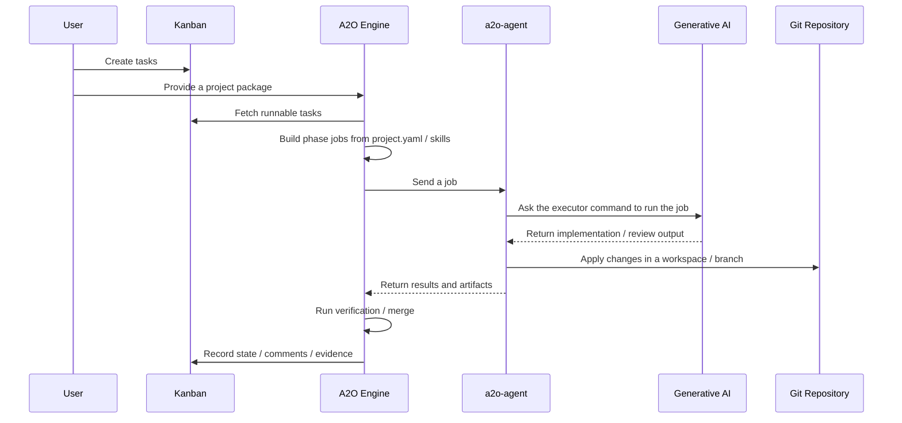

# A2O Overview

This document explains what A2O does and how users, project packages, kanban, A2O Engine, `a2o-agent`, Generative AI, and Git repositories connect.

Read this first. Before memorizing commands, understand A2O as a product that takes kanban tasks as input and turns them into Git results through AI execution and verification. The setup steps are easier to follow once you know who owns each input and where the output is recorded.

## What A2O Does

A2O treats AI-assisted implementation, verification, merge, and evidence recording as one runtime flow that starts from a kanban task.

## Inputs, Processing, Outputs

| Area | Content |
|---|---|
| What users provide | Git repositories, a project package, AI skills, verification / remediation commands, kanban tasks |
| What A2O reads | `project.yaml`, kanban tasks, skill files, runtime state |
| What A2O drives | Scheduler, phase jobs, agent jobs, verification, merge, evidence recording |
| What the agent runs | Executor commands, product toolchains, Generative AI calls |
| Where results remain | Git branches / merge results, kanban comments / state, evidence, agent artifacts |

## Normal Runtime Flow

Git operations happen in different places depending on the phase and workspace. The user-facing results are Git branches or merge results, kanban state and comments, and A2O evidence.

## Responsibilities

| Element | Responsibility | What users watch |
|---|---|---|
| Kanban | Task queue and user-visible state | Create tasks and inspect status |
| Project package | Product-specific input | Declare repositories, skills, commands, and verification |
| A2O Engine | Runtime orchestration | Let the scheduler and phases progress |
| `a2o-agent` | Execution in the product environment | Make the toolchain and AI executor available |
| Generative AI | Implementation and review assistance | Follow the task and skills |
| Git repository | Final work product | Inspect branches and merge results |

After this flow is clear, the quickstart commands should read as steps that connect these responsibilities rather than unrelated setup chores.

## How The Parts Fit

`project.yaml` tells A2O which board to read, which repositories to handle, and which commands or skills to use in each phase.

AI skill files are working rules passed to the executor command. A2O Engine does not execute skills directly; it uses them as material for phase jobs.

Kanban is both the work queue and the visible state system. A2O Engine pulls tasks from kanban, then records progress and decisions back to kanban.

`a2o-agent` is the product-environment runner. A2O Engine manages progress inside the runtime; product-specific commands run through the agent side.

Git repositories hold the final output. A2O uses branch namespaces and merge phases to treat AI execution results as normal Git changes.

## Reading Path

Start with these documents:

1. [10-quickstart.md](10-quickstart.md): run the smallest working setup.
2. [20-project-package.md](20-project-package.md): understand the inputs users own.
3. [30-operating-runtime.md](30-operating-runtime.md): operate the scheduler, agent, kanban, and runtime image.
4. [40-troubleshooting.md](40-troubleshooting.md): know where to look when a task blocks or fails.

Detailed schemas and compatibility names are references to read later.
