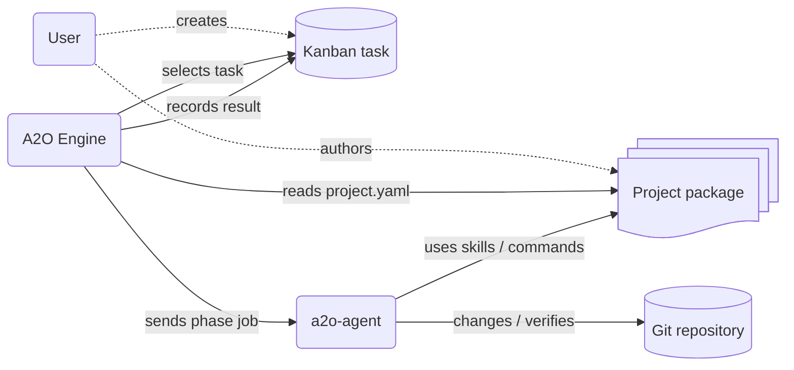

# Project Package

Use this guide when designing or reviewing an A2O project package. A project package is the input that tells A2O how to handle one product: which repositories exist, which skills and commands to use, how verification works, and what kinds of kanban tasks humans create.

The full `project.yaml` field reference is [90-project-package-schema.md](90-project-package-schema.md). This guide is about intent and responsibility. Treat `project.yaml` as the product specification A2O runs from, not just as a configuration file.

## Package Inputs

A project package collects four kinds of user-managed input in one directory.

| Input | Role | When A2O uses it |
|---|---|---|
| `project.yaml` | Defines package name, kanban project, repo slots, phases, executor commands, and verification commands | Bootstrap, kanban setup, runtime execution |
| `skills/` | Product-specific judgment rules passed to AI workers | Implementation, review, parent review |
| `commands/` | Build, test, verification, remediation, and worker commands | Phase execution, verification, remediation |
| `task-templates/` | Human-facing examples for creating kanban tasks | Task authoring |

A2O does not infer product policy from source code. If a worker needs a repository boundary, command, rule, or verification method, put it in the project package.

## Runtime Connection



Users manage the project package and kanban tasks. A2O Engine reads `project.yaml` to decide which kanban board to watch, which repositories to handle, and what to run in each phase. `a2o-agent` executes the jobs using package skills and commands, then changes and verifies Git repositories.

## Package Boundary

A2O is a generic orchestration engine. It owns kanban orchestration, workspace creation, phase execution, verification/remediation orchestration, merge orchestration, and evidence recording.

The project package owns product-specific decisions:

- repository slots and kanban labels
- AI worker commands
- implementation and review skills
- build, test, verification, and remediation commands
- project-specific coding rules
- optional knowledge catalog commands
- task templates used by humans to create board tasks

A2O-managed lanes and internal labels are not part of the package authoring surface. `a2o kanban up` provisions them.

## Recommended Layout

```text
project-package/
  README.md
  project.yaml
  commands/
  skills/
    implementation/
    review/
  task-templates/
  tests/
    fixtures/
```

`project.yaml` is the only public package configuration file. It declares package identity, kanban selection, repository slots, agent prerequisites, runtime phases, verification/remediation commands, and merge policy.

`commands/` contains project-owned scripts called by runtime phases. Keep production commands and test fixtures clearly separated. Scripts in `commands/` should be safe to run for real tasks.

`skills/` contains project rules passed to AI workers. Skills should be short, concrete, and specific to the phase that uses them.

`task-templates/` contains human-facing task templates. A2O does not enqueue them automatically.

For multi-repo parent-child workflows, write task templates with explicit repo labels. A parent task that affects two repositories should carry both repo labels, for example `repo:catalog` and `repo:storefront`. Avoid synthetic aggregate labels that mean "all repos" or "both repos".

`tests/fixtures/` contains deterministic workers, fake inputs, or package validation fixtures. Runtime production config should not reference this directory.

## Production Config And Test Fixtures

Keep `project.yaml` for normal operation. Do not point production implementation/review phases at deterministic fixture workers.

If a package needs a test profile, keep it explicit:

- use a separate config such as `project-test.yaml`
- keep fixture workers under `tests/fixtures/`
- name verification fixtures so they cannot be mistaken for production commands
- document how to run the test profile

Validate the alternate profile explicitly:

```sh
a2o project validate --package ./project-package --config project-test.yaml
```

Run it explicitly when you need a focused test profile:

```sh
a2o runtime run-once --project-config project-test.yaml
```

Do not use `--project-config` for the resident scheduler unless the alternate config is intended to process real board tasks.

The normal package path should answer a simple question: "What will run when a real board task is selected?"

## Worker Protocol

Implementation, review, and parent review phases run through an executor command declared in `runtime.phases.<phase>.executor.command`.

The command receives a worker request bundle on stdin and writes the worker result JSON to `{{result_path}}`. A typical command looks like:

```yaml
runtime:
  max_steps: 20
  agent_attempts: 200
  agent_poll_interval: 1s
  agent_control_plane_connect_timeout: 5s
  agent_control_plane_request_timeout: 30s
  agent_control_plane_retry_count: 2
  agent_control_plane_retry_delay: 1s
  review_gate:
    child: false
    single: false
    skip_labels: []
    require_labels: []
  phases:
    implementation:
      skill: skills/implementation/base.md
      executor:
        command: [your-ai-worker, --schema, "{{schema_path}}", --result, "{{result_path}}"]
```

Use these rules:

- Treat `{{schema_path}}`, `{{result_path}}`, `{{workspace_root}}`, `{{a2o_root_dir}}`, and `{{root_dir}}` as the public placeholders.
- Treat the worker request JSON and `A2O_*` environment variables as the stable runtime contract.
- Do not read private `.a3` metadata or generated launcher files from project scripts.
- Make worker failures actionable: explain which command failed, which repo/workspace was involved, and what the user should fix.

`runtime.review_gate.child` and `runtime.review_gate.single` are optional. The default is `false`, which keeps the historical flow where child and single tasks move from implementation to verification. When set to `true`, implementation success moves that task kind into the review phase first; review approval then continues to verification, and review findings can send the task back to implementation.

`runtime.review_gate.skip_labels` and `runtime.review_gate.require_labels` optionally override the task-kind default per kanban task. `require_labels` turns the review gate on when a task has a matching label, and `skip_labels` turns it off when a task has a matching label. If both match, `skip_labels` wins.

Generate a minimal worker with:

```sh
a2o worker scaffold --language python --output ./project-package/commands/a2o-worker.py
```

For projects that delegate implementation to an external AI or worker command, generate a wrapper scaffold instead of calling that command directly from `project.yaml`:

```sh
a2o worker scaffold --language command --output ./project-package/commands/a2o-command-worker
```

The generated wrapper forwards the A2O stdin bundle to the command configured in `A2O_WORKER_COMMAND`. That command must print the final A2O worker result JSON to stdout. The wrapper preserves the A2O result contract and rejects implementation success that omits `review_disposition`.

Then reference it from `runtime.phases.<phase>.executor.command`:

```yaml
command:
  - ./project-package/commands/a2o-worker.py
  - "--schema"
  - "{{schema_path}}"
  - "--result"
  - "{{result_path}}"
```

When developing a custom worker, save one worker request and result pair and validate it with:

```sh
a2o worker validate-result --request request.json --result result.json
```

The validator reports concrete missing keys, type errors, and `task_ref` / `run_ref` / `phase` mismatches before runtime execution. If your executor uses configured review disposition slot scopes, pass the same public values with repeated `--review-slot-scope SCOPE`.

If the worker cannot continue because the requested product behavior is ambiguous or conflicts with an existing contract, return `success=false`, `rework_required=false`, and `clarification_request` instead of using `blocked` diagnostics:

```json
{
  "success": false,
  "summary": "Requirement conflicts with the current permission model.",
  "rework_required": false,
  "clarification_request": {
    "question": "Should admin approval be required for this bypass?",
    "context": "The ticket asks for a bypass, but the current permission model requires explicit approval.",
    "options": ["Require admin approval", "Keep the current model"],
    "recommended_option": "Require admin approval",
    "impact": "A2O pauses scheduling for this task until the requester answers."
  }
}
```

Use `clarification_request` only for requester input. Runtime failures, invalid worker output, verification failures, merge conflicts, and missing credentials should remain technical failures with `failing_command` / `observed_state` so they become `blocked` diagnostics.

## Verification And Remediation

Verification commands prove the task result. Remediation commands may format code or perform project-approved cleanup before verification retries.

Good verification commands are deterministic and scoped:

- run the smallest command that proves the changed surface
- print enough context to diagnose failures
- exit non-zero when the task is not ready
- avoid hidden network or global machine dependencies when possible

If verification differs by parent/child/single task or by repo slot, keep that policy visible in `project.yaml` with command variants. Prefer a small default command and add only the exceptional cases:

```yaml
runtime:
  phases:
    verification:
      commands:
        default:
          - app/project-package/commands/verify-all.sh
        variants:
          task_kind:
            parent:
              phase:
                verification:
                  - app/project-package/commands/verify-parent.sh
```

Good remediation commands are conservative:

- format or regenerate known project artifacts
- avoid changing product behavior
- avoid committing, pushing, or editing kanban state

## Optional Metrics Collection

Projects may add an optional metrics command that runs after successful verification. This is for lightweight operational reporting; it does not affect whether verification passed.

```yaml
runtime:
  phases:
    metrics:
      commands:
        - app/project-package/commands/collect-metrics.sh
```

The command runs in the prepared workspace with `command_intent=metrics_collection` in the worker request. It should print one JSON object to stdout. A2O owns `task_ref`, `parent_ref`, and `timestamp`; the project may provide these sections:

- `code_changes`
- `tests`
- `coverage`
- `timing`
- `cost`
- `custom`

Unsupported top-level sections or non-object section values are recorded as metrics collection diagnostics. They do not turn a successful verification into a failed verification.

Use the runtime metrics exports for reporting:

```sh
a2o runtime metrics list --format json
a2o runtime metrics list --format csv
a2o runtime metrics summary
a2o runtime metrics summary --group-by parent --format json
a2o runtime metrics trends --group-by parent --format json
```

Grafana, spreadsheets, and BI tools should consume these exports or downstream copies of them. They are not required runtime dependencies for the first metrics implementation.

## Notification Hooks

Projects may add notification hooks under `runtime.notifications`. A2O invokes matching commands after a phase transition has been determined and persisted, then passes the event payload path in `A2O_NOTIFICATION_EVENT_PATH`.

```yaml
runtime:
  notifications:
    failure_policy: best_effort
    hooks:
      - event: task.blocked
        command: [app/project-package/commands/notify.sh]
      - event: task.completed
        command: [app/project-package/commands/notify.sh]
```

A2O owns the hook timing and payload shape. The project package owns all destinations such as Slack, Discord, GitHub comments, email, or internal systems. A2O does not include destination-specific notifier logic.

Supported phase-completion events are:

- `task.phase_completed`
- `task.blocked`
- `task.needs_clarification`
- `task.completed`
- `task.reworked`
- `parent.follow_up_child_created`

The default `failure_policy` is `best_effort`, which records hook failures without changing task progress. `blocking` records the same diagnostics and fails the runtime command after the committed state is visible. Hook stdout, stderr, exit status, timing, command, and payload path are stored in the latest phase execution diagnostics under `notification_hooks`.

## Phase Skills

Skills are project-owned instructions for workers. Keep them focused on decisions the worker cannot infer safely.

Implementation skills should cover:

- repository boundaries and editable paths
- coding rules
- verification expectations
- when to use project knowledge commands
- what evidence to record

Review skills should cover:

- what counts as a finding
- expected verification evidence
- public API, SPI, compatibility, and documentation checks
- how to report residual risk

Parent review skills should cover multi-repo integration:

- how child outputs are combined
- which integration checks must pass before publishing
- merge readiness checks
- evidence expected before merge

Use the language your maintainers will actually maintain. A Japanese project package can use Japanese skills.

## Knowledge Catalogs

A2O does not require a knowledge catalog and does not depend on a specific catalog implementation.

If a project has one, expose it as project-owned commands or Taskfile entries and describe them in the relevant skills. Prefer narrow, task-specific queries over open-ended exploration.

Use the catalog differently by workflow stage:

- Planning and task decomposition may use broader catalog queries. Summarize relevant findings in the kanban task so runtime workers do not need to rediscover the same context.
- Implementation workers should receive or run only task-specific queries. Give them the command name, expected query shape, and the reason to use it.
- Review and parent review workers should use catalog queries to check changed API/SPI surfaces, repository boundaries, product rules, and integration assumptions related to the diff.
- Do not require MCP. A project-owned CLI, script, or Taskfile query is enough when it is deterministic and documented in the package.

Use knowledge results as supporting context. Source code, docs, tests, and verification results remain authoritative.

## Review Checklist

Before using a package for real tasks, check:

- `project.yaml` is the only public config file.
- `a2o project lint --package ./project-package` has no blocked findings.
- A2O-owned lanes and internal labels are not hand-authored in package config.
- `agent.required_bins` includes the product toolchain and worker executable.
- Production phases do not call `tests/fixtures/`.
- Verification commands fail clearly and print useful diagnostics.
- Remediation commands cannot make broad unintended changes.
- Skills state repo boundaries, review criteria, and evidence expectations.
- Generated files stay under `.work/a2o/`.
- User-facing docs and commands use A2O names.
