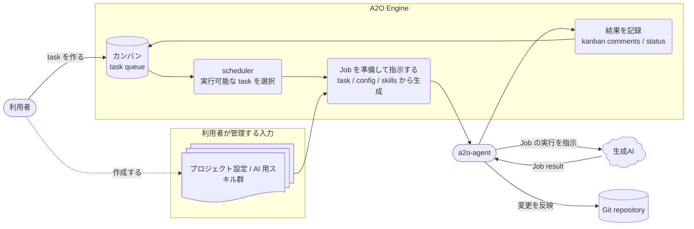

# A2O Architecture

この文書は、A2O Engine が kanban、project package、a2o-agent、生成AI、Git repository をどうつなぎ、task automation をどう成立させるかを説明する。

設計資料の入口として、まず全体の流れを押さえ、その後で domain model、workspace、agent gateway、kanban adapter などの詳細へ進む。

## 読み進め方

まずこの文書で runtime flow と責務境界を把握する。次に、知りたい設計面に合わせて詳細文書を読む。

| 知りたいこと | 次に読む文書 |
| --- | --- |
| 日常的な開発判断と review standard | [10-engineering-rulebook.md](10-engineering-rulebook.md) |
| A2O の用語と bounded context | [20-bounded-context-and-language.md](20-bounded-context-and-language.md) |
| Task、Run、Phase、Evidence の domain model | [30-core-domain-model.md](30-core-domain-model.md) |
| Workspace、repo slot、branch namespace | [40-workspace-and-repo-slot-model.md](40-workspace-and-repo-slot-model.md) |
| Project package に公開する設定面 | [50-project-surface.md](50-project-surface.md) |
| Project command / worker contract | [55-project-script-contract.md](55-project-script-contract.md) |
| Evidence、blocked diagnosis、rerun | [60-evidence-and-rerun-diagnosis.md](60-evidence-and-rerun-diagnosis.md) |
| a2o-agent との job 境界 | [70-agent-worker-gateway-design.md](70-agent-worker-gateway-design.md) |
| Core と project extension の境界 | [80-runtime-extension-boundary.md](80-runtime-extension-boundary.md) |
| Reference product による validation | [90-reference-product-suite.md](90-reference-product-suite.md) |
| Kanban adapter と SoloBoard 境界 | [95-kanban-adapter-boundary.md](95-kanban-adapter-boundary.md) |

## A2O が実現する runtime flow

A2O は「kanban task を AI 実行可能な job に変換し、検証と merge までを traceable に進める」runtime である。

1. 利用者が project package と kanban task を用意する。
2. Scheduler が runnable task を選ぶ。
3. Engine が task、`project.yaml`、skill、repo slot から phase job を作る。
4. `a2o-agent` が host / dev-env で executor command を実行する。
5. Executor が生成AIと product toolchain を使って変更を作る。
6. Engine が verification、merge、evidence、kanban status を管理する。

この flow を支えるために、domain model は task lifecycle を、workspace model は source と branch を、agent gateway は外部 command 実行を、kanban adapter は visible task state を担当する。

## システム概観

通常利用では、利用者は kanban task とプロジェクト入力を作成する。常駐 scheduler は Engine が管理する kanban state から実行可能な task を選ぶ。Engine は task、プロジェクト設定、AI 用スキル群を組み合わせて AI 実行 job を用意する。`a2o-agent` は host または project dev-env で job を実行し、生成AIに job の実行を指示し、結果を Git repository に反映する。Engine は task status、comments、evidence を kanban に記録する。

## 責務境界

- A2O Engine: task lifecycle、scheduler、phase orchestration、kanban adapter、evidence、merge orchestration。
- Project package: project 固有の repo slots、labels、skills、executor commands、verification / remediation commands。
- a2o-agent: product 環境での command execution、workspace materialization、artifact publication。
- 生成AI: executor command から指示される実装・レビュー補助。
- Git repository: AI 実行結果と merge 結果を保持する成果物。

## Task lifecycle

| 状態 | 意味 | 主な所有者 |
|---|---|---|
| `To do` | scheduler が pickup できる候補 | Kanban / Engine |
| `In progress` | implementation または runtime phase が進行中 | Engine |
| `In review` | review / inspection 相当の確認中 | Engine / agent job |
| `Inspection` | 検証結果や親子 task の統合判断を確認する段階 | Engine |
| `Merging` | source を target ref へ統合する段階 | Engine / Git workspace |
| `Done` | A2O automation が完了した状態 | Engine / Kanban |
| `Blocked` | operator action が必要な状態 | Engine / operator |

Kanban lane は visible state であり、domain object は task status、current run、phase、terminal outcome を保持する。

## Phase と責務

| Phase | 目的 | 主な入力 | 主な出力 |
|---|---|---|---|
| `implementation` | 変更を作る | task、skill、repo slot | work branch、agent artifact |
| `review` | 実装結果を確認する | source descriptor、review skill | review disposition、evidence |
| `parent_review` | child 結果を統合判断する | parent scope、child outputs | parent evidence |
| `verification` | deterministic gate を通す | workspace、verification command | pass / failed evidence |
| `remediation` | deterministic repair を試す | failed verification context | formatted / repaired workspace |
| `merge` | target ref へ統合する | source ref、target ref、merge policy | merge result、kanban update |

## Data ownership

| Data | 所有者 | 使い道 |
|---|---|---|
| kanban task / lane / comment | Kanban adapter | 利用者に見える queue と status |
| runtime task / run state | A2O Engine | scheduler と phase transition の判断 |
| project package | 利用者 / product team | repo slots、skills、commands、verification の宣言 |
| agent workspace / artifact | a2o-agent | product 環境での実行結果とログ |
| Git branch / merge result | Git repository | 最終成果物と統合結果 |
| evidence / blocked diagnosis | A2O Engine | failed / completed run の調査 |

## 設計資料一覧

### 0. 利用者導線

- [../user/00-overview.md](../user/00-overview.md)
- [../user/10-quickstart.md](../user/10-quickstart.md)

A2O の全体像と導入手順を扱う。

### 1. 実装規律

- [10-engineering-rulebook.md](10-engineering-rulebook.md)

immutable、TDD、リファクタリング、必要修正から逃げないことを固定する。

### 2. 用語と bounded context

- [20-bounded-context-and-language.md](20-bounded-context-and-language.md)

task kind、phase、workspace、repo slot、evidence などの用語を固定する。

### 3. core domain model

- [30-core-domain-model.md](30-core-domain-model.md)

aggregate / entity / value object と状態遷移を扱う。

### 4. workspace / repo-slot / lifecycle

- [40-workspace-and-repo-slot-model.md](40-workspace-and-repo-slot-model.md)

fixed repo slot、同期方針、freshness、retention、GC、merge workspace を扱う。

### 5. Project Surface

- [50-project-surface.md](50-project-surface.md)
- [55-project-script-contract.md](55-project-script-contract.md)
- [../user/90-project-package-schema.md](../user/90-project-package-schema.md)
- [80-runtime-extension-boundary.md](80-runtime-extension-boundary.md)

project package schema、project script contract、repo slot、verification、bootstrap hook の境界を扱う。

### 6. evidence / rerun / blocked diagnosis

- [60-evidence-and-rerun-diagnosis.md](60-evidence-and-rerun-diagnosis.md)

review / merge / rerun / blocked 調査の再現性を支える内部 evidence を扱う。

### 7. runtime distribution

- [../user/30-operating-runtime.md](../user/30-operating-runtime.md)
- [70-agent-worker-gateway-design.md](70-agent-worker-gateway-design.md)
- [../user/95-runtime-naming-boundary.md](../user/95-runtime-naming-boundary.md)

Docker runtime image、host launcher、bundled kanban service、agent gateway、内部互換名の境界を扱う。

### 8. reference validation

- [90-reference-product-suite.md](90-reference-product-suite.md)

core validation で使う sample product と validation boundary を扱う。

### 9. current release surface

- [../user/80-current-release-surface.md](../user/80-current-release-surface.md)

A2O 0.5.5 の supported public surface と validation boundary を扱う。

### 10. kanban adapter boundary

- [95-kanban-adapter-boundary.md](95-kanban-adapter-boundary.md)

kanban command contract と adapter boundary を扱う。

## 知りたいことから探す

| 知りたいこと | 読む文書 |
|---|---|
| task / run / phase の状態遷移 | [30-core-domain-model.md](30-core-domain-model.md) |
| workspace と branch の作り方 | [40-workspace-and-repo-slot-model.md](40-workspace-and-repo-slot-model.md) |
| project package から何を読めるか | [50-project-surface.md](50-project-surface.md) |
| project script の contract | [55-project-script-contract.md](55-project-script-contract.md) |
| agent job の受け渡し | [70-agent-worker-gateway-design.md](70-agent-worker-gateway-design.md) |
| blocked 時の evidence | [60-evidence-and-rerun-diagnosis.md](60-evidence-and-rerun-diagnosis.md) |
| kanban adapter の責務境界 | [95-kanban-adapter-boundary.md](95-kanban-adapter-boundary.md) |
