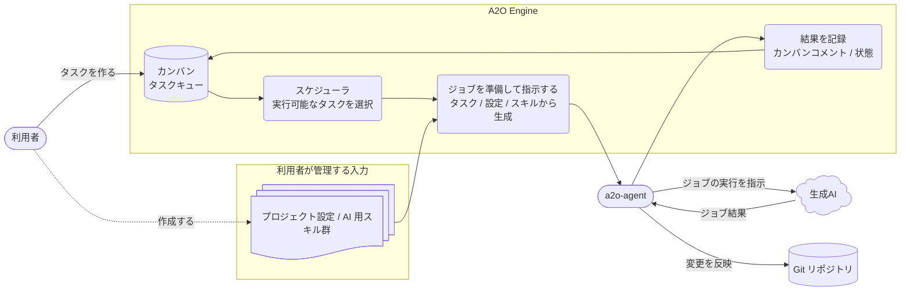

# A2O アーキテクチャ

この文書は、A2O Engine がカンバン、プロジェクトパッケージ、a2o-agent、生成AI、Git リポジトリをどうつなぎ、タスク自動化をどう成立させるかを説明する。

設計資料の入口として、まず全体の流れを押さえ、その後でドメインモデル、ワークスペース、エージェント境界、カンバンアダプターなどの詳細へ進む。

読む目的は、個別のクラスや設定項目を見る前に、A2O の設計を「タスクを選ぶ」「ジョブを作る」「エージェントに委譲する」「結果を記録する」という流れで理解することである。新しい設計変更を入れるときは、まずこの文書で影響する境界を探し、該当する詳細文書へ進む。

## 読み進め方

まずこの文書でランタイムの流れと責務境界を把握する。次に、知りたい設計面に合わせて詳細文書を読む。

| 知りたいこと | 次に読む文書 |
| --- | --- |
| 日常的な開発判断とレビュー基準 | [10-engineering-rulebook.md](10-engineering-rulebook.md) |
| A2O の用語と Bounded Context | [20-bounded-context-and-language.md](20-bounded-context-and-language.md) |
| タスク、実行、フェーズ、証跡のドメインモデル | [30-core-domain-model.md](30-core-domain-model.md) |
| ワークスペース、リポジトリスロット、ブランチ名前空間 | [40-workspace-and-repo-slot-model.md](40-workspace-and-repo-slot-model.md) |
| プロジェクトパッケージに公開する設定面 | [50-project-surface.md](50-project-surface.md) |
| プロジェクトコマンド / ワーカー契約 | [55-project-script-contract.md](55-project-script-contract.md) |
| 証跡、ブロック診断、再実行 | [60-evidence-and-rerun-diagnosis.md](60-evidence-and-rerun-diagnosis.md) |
| a2o-agent とのジョブ境界 | [70-agent-worker-gateway-design.md](70-agent-worker-gateway-design.md) |
| コアとプロジェクト拡張の境界 | [80-runtime-extension-boundary.md](80-runtime-extension-boundary.md) |
| 参照用プロダクトによる検証 | [90-reference-product-suite.md](90-reference-product-suite.md) |
| カンバンアダプターと Kanbalone 境界 | [95-kanban-adapter-boundary.md](95-kanban-adapter-boundary.md) |

## A2O が実現するランタイムの流れ

A2O は「カンバンタスクを AI 実行可能なジョブに変換し、検証とマージまで追跡可能に進める」ランタイムである。

1. 利用者がプロジェクトパッケージとカンバンタスクを用意する。
2. スケジューラが実行可能なタスクを選ぶ。
3. Engine がタスク、`project.yaml`、スキル、リポジトリスロットからフェーズジョブを作る。
4. `a2o-agent` がホスト / 開発環境で実行コマンドを実行する。
5. 実行コマンドが生成AIとプロダクトのツールチェーンを使って変更を作る。
6. Engine が検証、マージ、証跡、カンバン状態を管理する。

この流れを支えるために、ドメインモデルはタスクライフサイクルを、ワークスペースモデルはソースとブランチを、エージェント境界は外部コマンド実行を、カンバンアダプターは利用者に見えるタスク状態を担当する。

## システム概観

通常利用では、利用者はカンバンタスクとプロジェクト入力を作成する。常駐スケジューラは Engine が管理するカンバン状態から実行可能なタスクを選ぶ。Engine はタスク、プロジェクト設定、AI 用スキル群を組み合わせて AI 実行ジョブを用意する。`a2o-agent` はホストまたはプロジェクトの開発環境でジョブを実行し、生成AIにジョブの実行を指示し、結果を Git リポジトリに反映する。Engine はタスク状態、コメント、証跡をカンバンに記録する。

## 責務境界

- A2O Engine: タスクライフサイクル、スケジューラ、フェーズ進行、カンバンアダプター、証跡、マージ進行。
- プロジェクトパッケージ: プロジェクト固有のリポジトリスロット、ラベル、スキル、実行コマンド、検証 / 修復コマンド。
- a2o-agent: プロダクト環境でのコマンド実行、ワークスペース具体化、成果物の公開。
- 生成AI: 実行コマンドから指示される実装・レビュー補助。
- Git リポジトリ: AI 実行結果とマージ結果を保持する成果物。

## タスクライフサイクル

| 状態 | 意味 | 主な所有者 |
|---|---|---|
| `To do` | スケジューラが取り込める候補 | カンバン / Engine |
| `In progress` | 実装またはランタイムフェーズが進行中 | Engine |
| `In review` | レビュー / 確認相当の段階 | Engine / エージェントジョブ |
| `Inspection` | 検証結果や親子タスクの統合判断を確認する段階 | Engine |
| `Merging` | ソースをターゲット参照へ統合する段階 | Engine / Git ワークスペース |
| `Done` | A2O の自動処理が完了した状態 | Engine / カンバン |
| `Blocked` | 運用者の対応が必要な状態 | Engine / 運用者 |

カンバンレーンは利用者に見える状態であり、ドメインオブジェクトはタスク状態、現在の実行、フェーズ、終了結果を保持する。

## フェーズと責務

| フェーズ | 目的 | 主な入力 | 主な出力 |
|---|---|---|---|
| `implementation` | 変更を作る | タスク、スキル、リポジトリスロット | 作業ブランチ、エージェント成果物 |
| `review` | 実装結果を確認する | ソース記述子、レビュースキル | レビュー判断、証跡 |
| `parent_review` | 子タスク結果を統合判断する | 親タスクの範囲、子タスクの出力 | 親タスクの証跡 |
| `verification` | 決定的な検証を通す | ワークスペース、検証コマンド | 成功 / 失敗の証跡 |
| `remediation` | 決定的な修復を試す | 失敗した検証の文脈 | 整形 / 修復済みワークスペース |
| `merge` | ターゲット参照へ統合する | ソース参照、ターゲット参照、マージ方針 | マージ結果、カンバン更新 |

## データの所有者

| データ | 所有者 | 使い道 |
|---|---|---|
| カンバンタスク / レーン / コメント | カンバンアダプター | 利用者に見えるキューと状態 |
| ランタイムタスク / 実行状態 | A2O Engine | スケジューラとフェーズ遷移の判断 |
| プロジェクトパッケージ | 利用者 / プロダクトチーム | リポジトリスロット、スキル、コマンド、検証の宣言 |
| エージェントワークスペース / 成果物 | a2o-agent | プロダクト環境での実行結果とログ |
| Git ブランチ / マージ結果 | Git リポジトリ | 最終成果物と統合結果 |
| 証跡 / ブロック診断 | A2O Engine | 失敗または完了した実行の調査 |

## 設計資料一覧

### 0. 利用者導線

- [../user/00-overview.md](../user/00-overview.md)
- [../user/10-quickstart.md](../user/10-quickstart.md)

A2O の全体像と導入手順を扱う。

### 1. 実装規律

- [10-engineering-rulebook.md](10-engineering-rulebook.md)

不変性、TDD、リファクタリング、必要修正から逃げないことを固定する。

### 2. 用語と Bounded Context

- [20-bounded-context-and-language.md](20-bounded-context-and-language.md)

タスク種別、フェーズ、ワークスペース、リポジトリスロット、証跡などの用語を固定する。

### 3. 中核ドメインモデル

- [30-core-domain-model.md](30-core-domain-model.md)

集約 / エンティティ / 値オブジェクトと状態遷移を扱う。

### 4. ワークスペース / リポジトリスロット / ライフサイクル

- [40-workspace-and-repo-slot-model.md](40-workspace-and-repo-slot-model.md)

固定リポジトリスロット、同期方針、鮮度、保持、GC、マージ用ワークスペースを扱う。

### 5. プロジェクト設定面

- [50-project-surface.md](50-project-surface.md)
- [55-project-script-contract.md](55-project-script-contract.md)
- [../user/90-project-package-schema.md](../user/90-project-package-schema.md)
- [80-runtime-extension-boundary.md](80-runtime-extension-boundary.md)

プロジェクトパッケージスキーマ、プロジェクトスクリプト契約、リポジトリスロット、検証、初期化 hook の境界を扱う。

### 6. 証跡 / 再実行 / ブロック診断

- [60-evidence-and-rerun-diagnosis.md](60-evidence-and-rerun-diagnosis.md)

レビュー / マージ / 再実行 / ブロック調査の再現性を支える内部証跡を扱う。

### 7. ランタイム配布

- [../user/30-operating-runtime.md](../user/30-operating-runtime.md)
- [70-agent-worker-gateway-design.md](70-agent-worker-gateway-design.md)
- [../user/95-runtime-naming-boundary.md](../user/95-runtime-naming-boundary.md)

Docker ランタイムイメージ、ホスト用ランチャー、同梱カンバンサービス、エージェント境界、内部互換名の境界を扱う。

### 8. 参照用検証

- [90-reference-product-suite.md](90-reference-product-suite.md)

コア検証で使うサンプルプロダクトと検証境界を扱う。

### 9. 現在の公開機能

- [../user/80-current-release-surface.md](../user/80-current-release-surface.md)

A2O 0.5.7 の対応済み公開機能と検証境界を扱う。

### 10. カンバンアダプター境界

- [95-kanban-adapter-boundary.md](95-kanban-adapter-boundary.md)

カンバンコマンド契約とアダプター境界を扱う。

## 知りたいことから探す

| 知りたいこと | 読む文書 |
|---|---|
| タスク / 実行 / フェーズの状態遷移 | [30-core-domain-model.md](30-core-domain-model.md) |
| ワークスペースとブランチの作り方 | [40-workspace-and-repo-slot-model.md](40-workspace-and-repo-slot-model.md) |
| プロジェクトパッケージから何を読めるか | [50-project-surface.md](50-project-surface.md) |
| プロジェクトスクリプトの契約 | [55-project-script-contract.md](55-project-script-contract.md) |
| エージェントジョブの受け渡し | [70-agent-worker-gateway-design.md](70-agent-worker-gateway-design.md) |
| ブロック時の証跡 | [60-evidence-and-rerun-diagnosis.md](60-evidence-and-rerun-diagnosis.md) |
| カンバンアダプターの責務境界 | [95-kanban-adapter-boundary.md](95-kanban-adapter-boundary.md) |
