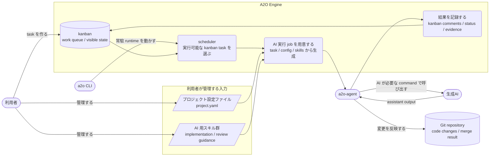

# A2O Design Map

この文書は、A2O の設計資料が何を扱うかと、どの順序で読むかを示す。

## 目的

- domain / application / infrastructure / project surface の責務境界を固定する。
- project 固有の rescue 分岐や workspace 依存を Engine core へ持ち込まない。
- 利用者向け surface と内部互換名の境界を明確にする。
- reference product suite を core validation の正本にする。

## アーキテクチャ概要

通常利用では、利用者は kanban task を作り、プロジェクト設定ファイルと AI 用スキル群を管理する。常駐 scheduler は Engine が管理する kanban state から実行可能な task を選ぶ。Engine は task、設定、skills を組み合わせて AI 実行 job を用意する。`a2o-agent` は host または project dev-env で job を実行し、設定された command が必要とする場合に生成AIを呼び出し、結果を Git repository に反映する。Engine は task status、comments、evidence を kanban に記録する。

## 設計資料一覧

### 0. 利用者導線

- [../user/00-user-quickstart.md](../user/00-user-quickstart.md)

A2O を導入する利用者向けのマニュアルである。

### 1. 実装規律

- [10-engineering-rulebook.md](10-engineering-rulebook.md)

immutable、TDD、リファクタリング、必要修正から逃げないことを固定する。

### 2. 用語と bounded context

- [20-bounded-context-and-language.md](20-bounded-context-and-language.md)

task kind、phase、workspace、repo slot、evidence などの用語を固定する。

### 3. core domain model

- [30-core-domain-model.md](30-core-domain-model.md)

aggregate / entity / value object と状態遷移を扱う。

### 4. workspace / repo-slot / lifecycle

- [40-workspace-and-repo-slot-model.md](40-workspace-and-repo-slot-model.md)

fixed repo slot、同期方針、freshness、retention、GC、merge workspace を扱う。

### 5. Project Surface

- [50-project-surface.md](50-project-surface.md)
- [55-project-script-contract.md](55-project-script-contract.md)
- [../user/10-project-package-schema.md](../user/10-project-package-schema.md)
- [80-runtime-extension-boundary.md](80-runtime-extension-boundary.md)

project package schema、project script contract、repo slot、verification、bootstrap hook の境界を扱う。

### 6. evidence / rerun / blocked diagnosis

- [60-evidence-and-rerun-diagnosis.md](60-evidence-and-rerun-diagnosis.md)

review / merge / rerun / blocked 調査の再現性を支える内部 evidence を扱う。

### 7. runtime distribution

- [../user/20-runtime-distribution.md](../user/20-runtime-distribution.md)
- [70-agent-worker-gateway-design.md](70-agent-worker-gateway-design.md)
- [../user/30-runtime-naming-boundary.md](../user/30-runtime-naming-boundary.md)

Docker runtime image、host launcher、bundled kanban service、agent gateway、内部互換名の境界を扱う。

### 8. reference validation

- [90-reference-product-suite.md](90-reference-product-suite.md)

core validation で使う sample product と、release validation の対象範囲を扱う。

### 9. implementation status

- [../user/40-release-status.md](../user/40-release-status.md)

0.5.2 release 時点の公開 surface と検証状態を扱う。

### 10. kanban adapter boundary

- [95-kanban-adapter-boundary.md](95-kanban-adapter-boundary.md)

kanban command contract と、将来の native adapter 実装に向けた境界を扱う。
