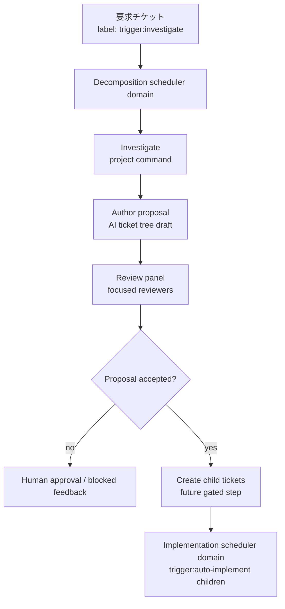

# チケット分解 MVP

この文書は、A2O#225 / GitHub issue #15 で扱う自動チケット分解の MVP 設計を定義する。

この機能は、大きな要求チケットを実装に入れる前に調査し、レビュー済みの子チケット案へ分解する。最初のリリースでは、チケット作成や実装開始を過度に自動化せず、スケジューリング境界とレビューの形を安全に固める。

## 問題

現在の A2O は、すでに実装可能な粒度になっているカンバンタスクを実行する。利用者が大きな要求チケットを作った場合、調査、分解、子チケット作成、実装計画は、まだ人間またはその場限りの agent 指示に依存している。

その結果、次の問題が起きる。

- 境界や依存関係が曖昧なまま大きなチケットが実装に入る
- 実装作業が進行中だと、独立に進められるはずのチケット分解作業まで待たされる

したがって MVP では、分解を既存の実装フェーズに見せかけるのではなく、独立したランタイム責務として導入する。

## 目的

- `trigger:investigate` が付いた大きな要求チケットを検出する。
- プロジェクトが所有する調査コマンドを実行し、プロダクト固有の文脈を集める。
- 子チケットのスコープ、依存関係、ラベル、検証期待、受け入れ条件を含むチケットツリー案を作る。
- 自動作成前に、複数の観点を持つ reviewer で案をレビューする。
- チケット分解のスケジューリングを実装スケジューリングから独立させる。
- 初期実装では、プロジェクトごとに同時実行される分解パイプラインを 1 つに制限する。

## 対象外

- A2O は静的解析、リポジトリ調査、プロダクト固有の調査ツールを同梱しない。
- MVP では複数のチケットツリー分解を並列実行しない。
- MVP では生成された子チケットを自動実装しない。
- 既存の `Task.kind` である `single` / `parent` / `child` を分解用途に流用しない。
- 分解を既存の `implementation` フェーズに押し込まない。

## スケジューリング境界

チケット分解と実装は、別の scheduler domain として扱う。

| domain | trigger | 担当する作業 | 同時実行 |
| --- | --- | --- | --- |
| implementation | 通常の A2O 実行可能タスク状態 | implementation, review, verification, remediation, merge, parent review | 既存の実装ランタイム方針 |
| decomposition | 大きな要求チケット上の `trigger:investigate` | investigate, author proposal, proposal review, 任意の gated child creation | MVP ではプロジェクトごとに 1 本 |

重要な不変条件は次のとおり。

> 実装タスクが進行中であっても `trigger:investigate` チケットの進行を止めてはならない。また、分解パイプラインが進行中であっても通常の実装タスクの進行を止めてはならない。

domain routing は排他的に扱う。`trigger:investigate` を持つ source ticket は decomposition domain が所有し、decomposition gate が明示的に label または状態を変更するまでは、通常の implementation runnable selection から除外する。implementation scheduler domain に入れるのは、`trigger:auto-implement` が付いたチケットなど、実装対象として作成または承認された child ticket だけである。

両 domain は、カンバンアダプター、プロジェクトパッケージ、リポジトリスロット、証跡ストアを共有してよい。ただし runnable queue と active-run lock は分離する。実装側の `max_steps`、フェーズ状態、worker 使用状況を分解の gate として再利用してはならない。同様に、分解側の `max_steps` や proposal review 状態が実装選択を止めてはならない。

チケット作成処理そのものは、MVP では並列化しない。分解パイプラインを 1 本に制限することで、子チケットの重複作成を避け、レビューコストを抑え、idempotency を単純に保つ。一方で、実装作業は並行して進められる。

## ランタイムフロー



MVP はレビュー済み proposal の作成で止められる。proposal 形式、レビュー結果、重複防止が十分に検証されるまでは、子チケットの自動作成は明示的な gate の後続ステップとする。

## 調査コマンド契約

調査はプロジェクトが所有する。A2O はライフサイクル、request、result validation、証跡保持、カンバン更新を提供する。

プロジェクトパッケージは次のようなコマンド宣言を持つ。

```yaml
runtime:
  decomposition:
    investigate:
      command: ["./commands/investigate.sh"]
    author:
      command: ["./commands/author-proposal.sh"]
```

正確な schema は今後詰めるが、公開契約は既存の project script contract と同じ考え方に寄せる。

- A2O は `A2O_*` 環境変数で JSON request path を渡す。
- コマンドは `A2O_*` result path に単一の JSON result を書く。
- スクリプトは private runtime file ではなく、宣言された slot path から repo path を読む。
- investigation は隔離された read-only snapshot または disposable workspace に対して実行し、active implementation workspace を使わない。
- investigation command は repo slot を変更せず、implementation branch を作らず、implementation run を止める lock を取得しない。
- 非ゼロ終了または不正 JSON は、証跡付きで分解パイプラインを block する。

user-facing な decomposition CLI action は、project command が host-only AI worker CLI、credential、local agent config を必要とする場合、host-agent command protocol 経由で project-owned command を実行する。詳細は [77-host-agent-decomposition-command-protocol.md](77-host-agent-decomposition-command-protocol.md) を参照する。

request には次を含める。

- source ticket ref、title、description、label、priority
- source ticket の parent / child / blocker relation
- repo slot alias と workspace path
- 実装や検証に関係する project package metadata
- 利用可能な repo label と対応する task kind
- rerun 時の過去の decomposition evidence

result には次を含める。

- 要求とプロダクト文脈の summary
- 影響を受ける module、file、command、API、schema、外部 system
- 既知の依存関係と順序制約
- risk area と confidence
- 推奨されるチケット境界
- 自動作成を止めるべき open question
- evidence link または artifact path

## Author Proposal 契約

author step は、調査証跡を正規化された proposal に変換する。ここでは直接チケットを作らない。

author step は investigation と同じ project-script style に従う。A2O は author request JSON のパスを `A2O_DECOMPOSITION_AUTHOR_REQUEST_PATH` に渡し、`A2O_DECOMPOSITION_AUTHOR_RESULT_PATH` に proposal JSON object が 1 つ書かれることを期待する。実行は disposable decomposition workspace で行い、author output が不正な場合も proposal evidence を記録する。

proposal には次を含める。

- source ticket ref と proposal fingerprint
- source ticket を親として更新する場合の親更新案
- 子チケット draft の title、body、acceptance criteria、label、priority、verification level
- 提案された子チケット間の dependency graph
- 想定する blocker relation
- 想定する parent / child relation
- `trigger:auto-implement` の付与方針
- 各 child draft の安定した boundary と rationale
- 未解決の質問と、人間判断が必要な項目

proposal の `outcome` は省略時 `draft_children` とする。この outcome では、任意で generated parent の内容も指定できる。

```json
{
  "outcome": "draft_children",
  "parent": {
    "title": "Implementation plan title",
    "body": "人間が読む実装計画、設計メモ、child 一覧、全体 acceptance criteria。"
  },
  "children": []
}
```

調査の結果、要求が既存実装で満たされている場合、author は `outcome: "no_action"`、`children: []`、非空の `reason` を返せる。要求を安全に分解できない場合、author は `outcome: "needs_clarification"`、`children: []`、非空の `reason`、1 件以上の `questions` を返せる。これらの outcome も proposal review を通るが、child creation では generated parent / child を作成しない。

proposal には worker result と同じ schema の任意 `refactoring_assessment` を含められる。A2O はこの object を検証して保存するが、project 固有の refactoring 方針は決めない。何を refactoring debt とみなすか、それを現在の child set に含めるかは、project package の prompt、skill、docs が定義する。`include_child` は通常の child draft として refactoring work を proposal に含める判断である。`defer_follow_up` は child creation を block せず、proposal evidence、source-ticket comment、generated parent に debt を残し、parent review が follow-up child 化を判断できるようにする。`blocked_by_design_debt` と `needs_clarification` は、通常の technical blocked state と区別できるように扱う。

proposal fingerprint は idempotency のために必須とする。source ticket ref、source revision fields、investigation result digest、順序付き child draft content から生成する。

各 child draft には、source ticket ref と child boundary から導出する安定した child idempotency key も必要である。title のような揺れやすい文字列だけから作ってはならない。作成処理は proposal fingerprint で proposal version を識別し、child key で個別チケットを照合する。

## Review Panel

MVP の review panel は sequential に実行してよい。重要なのは並列実行ではなく、reviewer の責務観点が分かれていること。

推奨する reviewer scope:

- architecture reviewer: 境界、repo label、依存方向を確認する
- planning reviewer: 子チケット粒度、blocker graph、実装順序を確認する
- verification reviewer: acceptance criteria と決定的検証期待を確認する

critical finding が 1 つでもあれば、自動 child creation は block する。finding は proposal evidence に保存し、source ticket にも投稿する。clean review は次に設定された gate へ進めることを意味するが、作成済み child ticket なしに実装を開始してよいという意味ではない。

## カンバン作成境界

自動作成は、proposal-only mode が安定した後の gated step とする。

有効化する場合、作成処理は orchestration code から provider-specific call を散らすのではなく、カンバンアダプター境界を使う。multiline description、label、parent relation、blocker relation、comment が既存 command contract に従うよう、現在の child-ticket writer を再利用または一般化する。

作成処理は idempotent でなければならない。

- proposal fingerprint を source ticket の evidence または comment に保存する
- 作成した child ticket、relation comment、または evidence record に安定した child idempotency key を保存する
- rerun で proposal fingerprint が変わっても、child key によって作成済み child ticket を検出する
- partial creation が起きた場合は、新規作成より先に欠けている child や relation を補完する
- rerun で重複 child ticket を作らない
- 作成された ticket ref、relation result、失敗した write を記録する

生成された実装用 child には、proposal gate が implementation scheduler domain への投入を許可した後でのみ `trigger:auto-implement` を付ける。

## 証跡と状態

分解 run の証跡は、実装 run とは分離して公開する。

最低限の証跡:

- investigation request and result
- author proposal
- reviewer findings and final disposition
- proposal fingerprint
- child creation result, when enabled
- blocked reason and next operator action

runtime status と将来の watch-summary は、両 domain を表示できる必要がある。通常の implementation task tree 側で、分解を child implementation task のように見せる必要はない。

## Rollout Plan

1. 設計、schema 方針、scheduler invariant を文書化する。
2. `trigger:investigate` の proposal-only runtime support を追加する。
3. investigation command declaration の project-package validation を追加する。
4. review-panel evidence と blocking disposition を追加する。
5. 人間承認付き child-ticket creation を追加する。
6. duplicate prevention と review quality が検証できた後、自動 child creation を検討する。

## 検証要件

後続実装では次をテストする。

- 実装 scheduler の作業中でも decomposition runnable selection が止まらない
- decomposition active lock が implementation runnable selection を止めない
- MVP ではプロジェクトごとに active decomposition pipeline が 1 本だけになる
- 不正な investigation output が actionable evidence 付きで block される
- proposal review finding が child-ticket creation を止める
- child-ticket creation が rerun に対して idempotent である
- 生成された child が parent、blocker、label、`trigger:auto-implement` relation を保持する

参照用プロダクトには、少なくとも 1 つの明示的依存関係を含む複数の実装チケットへ分解される要求チケットを追加する。
