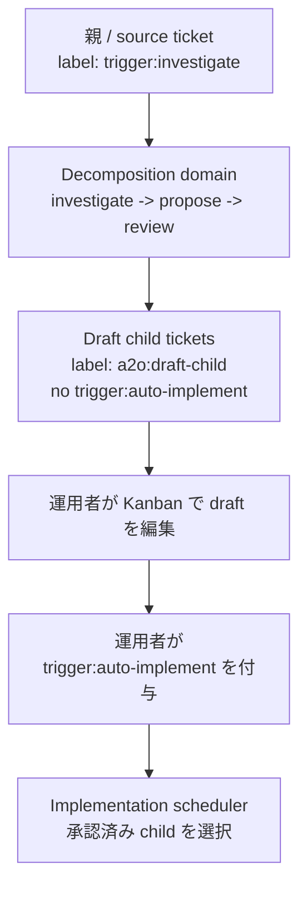

# Kanban-first な分解 draft child

この文書は、[75-ticket-decomposition-mvp.md](75-ticket-decomposition-mvp.md) で定義したチケット分解 MVP に対する A2O#356 の詳細設計である。

MVP では、`trigger:investigate` による調査、proposal 作成、proposal review を通常の実装スケジューラから独立して実行できることを確認した。A2O#356 では、eligible な proposal review の後の運用体験を変える。A2O が早い段階で draft child を Kanban に作り、運用者が Kanban 上で編集・承認できるようにする。

## 1. 問題

現在の分解フローはコマンド中心である。

1. 調査を実行する
2. proposal を作る
3. proposal をレビューする
4. gate 付きで child creation を実行する

これは安全だが、計画作業の多くが Kanban の外に残る。運用者は、提案された子チケットを実際の Kanban チケットとして確認し、title / body / label / order を Kanban 上で編集し、個別の子チケットを承認したい。

## 2. 目的

- `trigger:investigate` を Kanban-first な分解の入口として扱う。
- eligible な proposal review の後、child ticket を draft として自動作成または再同期する。
- draft child は、運用者が明示的に承認するまで runnable にしない。
- 分解 rerun で運用者の編集を保持する。
- proposal rerun や partial failure に対して child creation を idempotent にする。
- A2O#286 の remote source ticket flow を、実装開始を強制せずに支える。
- implementation scheduler の契約は単純に保つ。`trigger:auto-implement` が runnable gate である。

## 3. 対象外

- 主フローで別途 accept コマンドを必須にしない。
- 分解で作った draft child に `trigger:auto-implement` を自動付与しない。
- rerun で人間が編集した child ticket の title、body、label、priority、order を上書きしない。
- `a2o:draft-child` だけで実装を開始しない。
- この機能でプロジェクトごとの decomposition pipeline 同時実行数を増やさない。

## 4. 運用フロー

主たる承認操作は通常の Kanban 編集である。人間が child に `trigger:auto-implement` を付けた時点で、その child は runnable になる。`a2o:draft-child` の削除は任意のメタデータ整理であり、scheduler gate ではない。

draft child を一括変換する helper command は追加してよいが、これは便利機能にすぎない。MVP の利用者導線に必須としてはならない。

## 5. ラベルと状態の契約

| label | owner | 意味 |
| --- | --- | --- |
| `trigger:investigate` | 運用者 | source ticket を decomposition scheduler domain に入れる。 |
| `a2o:decomposed` | A2O | source ticket について、現在の proposal lineage で少なくとも一度 draft child creation / reconciliation が成功している。generated implementation parent にも付与する。 |
| `a2o:draft-child` | A2O | decomposition proposal から生成された child ticket で、計画上はまだ draft である。 |
| `trigger:auto-implement` | 運用者または helper | child が承認済みで、implementation scheduler domain に入ってよい。 |
| `a2o:ready-child` | 任意の運用慣習 | 将来の一括 accept command の選択補助。scheduler gate ではない。 |
| `trigger:auto-parent` | child acceptance 後の運用者、helper、または project policy | parent automation を明示的に要求する。draft creation では付けない。ただし A2O#286 の remote issue flow では、accepted child が runnable になった後に付与する導線が必要である。 |

scheduler は引き続き `trigger:auto-implement` を implementation gate として使う。`a2o:draft-child` があり `trigger:auto-implement` がない ticket は、Kanban には見えるが runnable ではない。

rerun 時に既存 draft child がすでに `trigger:auto-implement` を持っている場合、その label を保持し、運用者が承認済みであると扱う。

## 6. Draft child reconciliation

draft creation は追加だけの作成処理ではなく、再同期処理として扱う。

各 proposal は次を持つ。

- proposal fingerprint
- 安定した child idempotency key
- proposed parent relation
- proposed blocker relation
- proposed label と検証期待

writer は、変更されやすい title だけではなく child key によって既存 child を探す。child key は description の generated metadata block、A2O comment、evidence など、永続的かつ読める場所に保存する。同じ child key を主張する ticket が複数ある場合、A2O は推測で進めず、明確な診断で block する。

初回作成時、A2O は proposed title / body / acceptance criteria、`a2o:draft-child`、child key、proposal fingerprint、parent relation、blocker relation、audit comment を書く。
Kanban-first な draft writer は、child ticket に適用する前に proposal label を必ず filter する。`trigger:auto-implement` を proposal から draft child へコピーしてはならない。
proposal が実装投入の候補であることを示している場合も、その情報は evidence または audit comment にだけ記録する。

rerun 時、A2O は不足している A2O 所有の metadata、draft-safe label、comment、relation を補完してよい。
draft mode では `trigger:auto-implement` は A2O 所有 label ではなく、reconciliation が復元または追加してはならない。
すでにその label が存在する場合は、運用者または helper による承認判断として保持する。
ただし、利用者が編集する領域はデフォルトで置き換えない。

- title
- A2O metadata block 外の body / description
- acceptance criteria text
- priority
- 人間が追加した label
- 人間が外した必須ではない label
- 人間が決めた順序

新しい proposal が既存の編集済み child と食い違う場合、A2O は parent / source ticket と child-creation evidence に drift 診断を記録する。ticket を黙って上書きしない。

## 7. 自動 decomposition stage

A2O#356 では、eligible な proposal review の後に draft creation stage を自動で追加する。

eligible な proposal review とは、review disposition が child draft creation へ進んでよい状態であることを指す。reviewer finding がゼロである必要はない。blocking ではない finding、note、follow-up recommendation が残っていても、最終 disposition が eligible なら draft creation に進める。

decomposition scheduler は、運用者が各コマンドを手で実行しなくても、次の sequence を進められる必要がある。

1. `trigger:investigate` の source ticket を選択する
2. 必要なら investigation を実行する
3. 必要なら proposal を作成する
4. 必要なら proposal を review する
5. review disposition が eligible なら draft child を作成または再同期する
6. evidence を記録し、簡潔な Kanban audit comment を投稿する

implementation scheduler は独立したままである。draft creation は implementation worker の空きを待ってはならない。また、通常の implementation task は、通常の Kanban blocker relation 以外では draft creation を待ってはならない。

既存の手動 `create-children --gate` path は互換性のために残してよい。ただし Kanban-first な自動 path は、デフォルトで `trigger:auto-implement` を持たない draft child を作る。

## 8. 証跡と audit

parent / source ticket の evidence には次を含める。

- proposal に使った source ticket ref と source revision fields
- investigation evidence path
- proposal evidence path と proposal fingerprint
- review disposition
- child key ごとの draft child ref
- relation result
- reconciliation action
- drift diagnostic
- reconciliation が続行できない場合の blocked reason

各 decomposition stage は、完了時に source ticket へ短い comment を残す。必須の stage comment は次のとおり。

- investigation completed または blocked
- proposal authored または blocked
- proposal review completed。draft creation に進める eligible disposition かどうかを含める
- draft child creation / reconciliation completed または blocked

Kanban comment は短く、利用者が次に何をすべきか分かる内容にする。stage outcome を要約し、必要に応じて evidence を示し、どの draft child を作成または再同期したか、どう承認するかを伝える。詳細 JSON は evidence に置く。

child ticket には、運用者と rerun のために最低限次の metadata を残す。

- source ticket ref
- proposal fingerprint
- child key
- draft status
- 推奨 dependency notes

## 9. Remote source ticket 境界

A2O#286 の remote issue intake では、remote issue が `trigger:investigate` を受ける source ticket になりうる。draft child は引き続き Kanban 上の計画 artifact であり、`trigger:auto-implement` で承認されるまで runnable にしてはならない。

draft creation は source ticket に `trigger:auto-parent` を付けてはならない。子の実装作業がまだ承認されていない段階で remote issue parent を runnable にしてしまうためである。

1つ以上の draft child が承認され、`trigger:auto-implement` を持った後は、generated implementation parent を parent automation に進める導線が必要である。この導線は、運用者による手動 label、helper command、または明示的な project policy のいずれでもよい。ただし実行タイミングは draft creation 時ではなく child acceptance 後である。適用時には generated parent に `trigger:auto-parent` を付け、A2O#286 の parent flow が accepted child の delivery work を観測できるようにする。元の requirement source ticket は runnable な implementation parent ではなく、要求 artifact のまま扱う。

orchestration に provider-specific logic を散らさない。remote / local の差分は kanban adapter と child writer boundary の内側に閉じ込める。adapter が provider-backed child を作れない場合、A2O は remote source に紐づく local Kanban child を作り、その mapping を evidence に記録してよい。

## 10. Optional accept-drafts helper

A2O#357 の optional helper は、既存の draft child だけを変更する。新しい ticket を作ってはならない。

helper は次を満たす。

- explicit child または `a2o:ready-child` のような意図的に付けた集合を選択する
- `trigger:auto-implement` を追加する
- 任意で `a2o:draft-child` を削除する
- title、body、relation、order を変更しない
- idempotent である

手動で label を編集する導線が主たる承認 path のままである。

## 11. 検証要件

実装では次をテストする。

- `trigger:auto-implement` を持たない `a2o:draft-child` は runnable ではない
- eligible proposal review 後に automatic decomposition が draft child を作る
- draft creation が `trigger:auto-implement` を付けない
- rerun が child key によって既存 child を見つける
- rerun が人間の編集と承認済み child を保持する
- partial child creation を重複なしで再同期する
- child key 重複時に actionable diagnostic で block する
- source evidence が generated parent ref と作成・再同期された draft ref を記録する
- remote source decomposition が adapter boundary 経由で non-runnable draft child を作る
- remote source requirement は draft creation 時に `trigger:auto-parent` を受け取らない。generated parent は child acceptance 後に付与される導線がテストされている
- optional accept-drafts conversion は label だけを変更する

## 12. チケット分割

実装は上記設計の章に沿って分割する。

- 5章と6章: draft child writer と reconciliation behavior。
- 7章: eligible proposal review から draft reconciliation へ進む automatic scheduler stage。
- 8章: evidence と audit comment。
- 9章: remote source ticket boundary。
- 10章: optional accept-drafts helper。
- 11章: E2E と scheduler validation。
