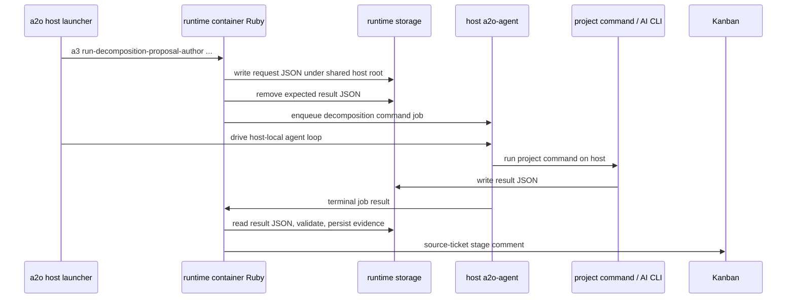

# Host-Agent Decomposition Command Protocol

この文書は A2O#411 の設計を定義する。project-owned decomposition command は、既存の decomposition request/result 契約を保ったまま、Copilot など host 側にしかない AI worker CLI を呼び出せる必要がある。

## 問題

`a2o runtime decomposition investigate`、`propose`、`review` は host launcher command だが、現在は `docker compose exec` で runtime container 内の Ruby command を実行する。その Ruby decomposition application が `runtime.decomposition.*.command` を `Open3` で実行するため、project script は runtime container 内で動く。

この topology では、host-only CLI、credential store、shell profile、browser integration、user-local agent config が必要な project command が失敗する。通常の runtime phase では project execution を host agent boundary に委譲しているため、その挙動ともズレている。

## 目的

- project-owned decomposition command を host 上の `a2o-agent` 経由で実行する。
- 既存の project package command schema と `A2O_DECOMPOSITION_*_REQUEST_PATH` / `A2O_DECOMPOSITION_*_RESULT_PATH` 契約を維持する。
- decomposition evidence、source-ticket comment、validation、Kanban behavior は runtime container 側で維持する。
- `investigate`、`propose`、`review` を共通 protocol で扱う。
- `create-children`、`status`、`cleanup` は runtime storage / Kanban operation であり project AI-worker command ではないため container-local のままにする。
- host agent path が使えない場合は、原因が分かる診断で fail する。

## 非目的

- Go launcher から任意の project command を直接実行すること。
- decomposition command に implementation workspace を変更させること。
- 既存の implementation / review / verification agent protocol を置き換えること。
- この hotfix path で remote non-local agent を許可すること。

## Protocol Shape

runtime container は decomposition orchestrator のままとする。request JSON の作成、result JSON の validation、evidence の保存、source-ticket comment の投稿は runtime container が担当する。host agent に委譲するのは project-owned command execution step だけである。



## Shared Path Contract

command request / result file は、runtime container と host agent の両方から見える path 配下に置かなければならない。host launcher はすでに `plan.HostRootDir` を host root として解決し、runtime container では `/workspace` として mount している。

host-agent decomposition では、runtime command に両方の形式を渡す。

- `--host-shared-root <host path>`
- `--container-shared-root /workspace`

Ruby decomposition application は container path に request / result file を作るが、agent job の環境変数には対応する host path を渡す。proposal authoring の例:

- Container request path: `/workspace/.work/a2o/decomposition-workspaces/<task>/.../decomposition-proposal-request.json`
- Host request path: `<host-root>/.work/a2o/decomposition-workspaces/<task>/.../decomposition-proposal-request.json`

project command には host path を環境変数で渡す。

- `A2O_DECOMPOSITION_REQUEST_PATH`
- `A2O_DECOMPOSITION_RESULT_PATH`
- `A2O_DECOMPOSITION_AUTHOR_REQUEST_PATH`
- `A2O_DECOMPOSITION_AUTHOR_RESULT_PATH`
- `A2O_DECOMPOSITION_REVIEW_REQUEST_PATH`
- `A2O_DECOMPOSITION_REVIEW_RESULT_PATH`
- `A2O_WORKSPACE_ROOT`
- `A2O_ROOT_DIR`

container path は、host path としても有効でない限り host command に渡してはならない。

この規則は環境変数だけでなく JSON payload の中身にも適用する。現在の decomposition request JSON には workspace root、slot path、artifact path、evidence path などの path field が含まれる。host-agent command に、host 上で読めない container-only な `/workspace/...` を渡してはならない。実装では次のどちらかを行う。

- host command が読む前に、project-visible な path をすべて host path に書き換える。ただし runtime-internal evidence 用には container path の copy を保持してよい。
- `path` / `container_path` または `host_path` / `container_path` のような paired field を持たせ、project command は host path field を読むと定義する。

hotfix では、既存の単純な script contract を保つため、project-visible request file の host-path rewriting を優先する。project command に露出しない runtime-owned evidence record では container path を保持してよい。

## Job Boundary

Ruby 側に decomposition command runner adapter を追加する。interface は既存 direct runner と同じ小さな形にする。

```ruby
call(command, chdir:, env:) -> [stdout, stderr, status]
```

adapter は `AgentJobRequest` を enqueue する。

- `phase`: 現行の agent job phase 制約との互換のため `verification`。加えて `worker_protocol_request.command_intent = "decomposition_<stage>"` を渡す。
- `task_ref`: source ticket ref。
- `run_ref`: `decomposition:<stage>:<task_ref>:<timestamp-or-request-id>` のような synthetic stable value。
- `working_dir`: decomposition trial の host workspace root。
- `command`: `sh`
- `args`: `["-lc", shell-joined project command]`
- `env`: host path の環境変数。
- `workspace_request`: 初期実装では `nil`。decomposition は shared root 配下に disposable workspace を自前で materialize する。
- `artifact_rules`: MVP では空。stdout/stderr は diagnostics 経由で扱う。

adapter は job completion を待ち、agent result を既存の `[stdout, stderr, status]` tuple に変換する。failed、timed out、cancelled、stale、enqueue failure、fetch failure は、非 success の status object と原因が分かる stderr に変換する。

agent worker は decomposition command intent の stdout/stderr を保持する必要がある。既存の notification command diagnostics は stdout/stderr を運んでいるため、`decomposition_` で始まる `command_intent` でも同じ diagnostics shape を使う。

hotfix 実装では、first-class な `decomposition` agent phase は追加しない。現行の agent job store、status reader、worker allow-list はすでに `verification` を理解しており、diagnostics 上の区別には `command_intent` で足りるためである。専用 phase を追加する場合は、これらの read/write surface を同時に更新できる後続 cleanup で扱う。

command intent を分類する worker-protocol surface は、すべて `decomposition_*` を decomposition intent として扱う必要がある。対象には docs-context selection、diagnostics labeling、Ruby validation、Go / agent 側 allow-list が含まれる。特定の surface で decomposition context が不要な場合は、その例外を code comment と test で明示する。generic verification intent への silent fallback は許可しない。

## Host Launcher Lifecycle

Go host launcher は container-side decomposition command を呼ぶ前に、`runtime run-once` と同じ local control-plane lifecycle を用意する。

1. runtime plan を作る。
2. runtime container を起動済みにする。
3. launcher config と host agent binary を準備する。
4. runtime agent server を起動する。
5. control plane readiness を待つ。
6. host-agent options と shared-root mapping を付けて、container-side `a3 run-decomposition-*` command を supervised container process として起動する。
7. container-side command が active の間、host-agent loop を動かす。
8. container command output を返し、temporary runtime process を cleanup する。

Go host launcher が Ruby decomposition application を host 上で直接実行してはいけない。runtime storage、Kanban adapter、package loading、containerized Ruby dependency は runtime image 側が所有しているためである。

`investigate`、`propose`、`review` では blocking な `docker compose exec` を使ってはならない。blocking call にすると、container command が enqueue した job を host-agent loop が claim できなくなるためである。代わりに、container command の stdout、stderr、exit-status、done-marker を temporary shared-root directory 配下に書かせる supervised process として起動し、done marker が出るまで host-agent loop を回してから output と exit status を回収する。これは他の supervised runtime container process と同じ運用パターンを decomposition CLI action に適用するものである。

## Stage Mapping

| CLI action | Project command execution | Notes |
| --- | --- | --- |
| `investigate` | host agent | request/result env は `A2O_DECOMPOSITION_REQUEST_PATH` / `A2O_DECOMPOSITION_RESULT_PATH` のまま。 |
| `propose` | host agent | author request/result env は現行と同じ。 |
| `review` | host agent | review command ごとに host-agent job を1件作る。result path は reviewer ごとに一意。 |
| `create-children` | container local | Kanban child ticket を書く処理であり host-only AI CLI は不要。 |
| `status` | container local | runtime storage の read のみ。 |
| `cleanup` | container local | runtime storage の read/remove のみ。 |

## Failure Semantics

- host agent binary がない: decomposition stage 実行前に fail。
- control plane unavailable: decomposition stage 実行前に fail。
- container command が agent job を enqueue する前に終了した: container stdout/stderr と exit status 付きで stage を fail する。
- container command の done marker が出ない: bounded timeout で host-agent loop を止め、supervised container process が残っていれば terminate し、最後の host-agent / control-plane activity とそれまでに集めた container output 付きで fail する。
- container command が待機中のまま host-agent loop が idle / budget exhaustion に到達した: 成功した空の decomposition result ではなく protocol / lifecycle error として fail する。
- agent enqueue/fetch failure: evidence 付きで stage を block し、stderr に control-plane error を残す。
- host command not found: exit 127 と host agent の stderr で stage を block する。
- result JSON missing/invalid: 既存通り blocked evidence として残す。
- result path が shared root 外: enqueue 前に configuration error。
- partial failure cleanup: launcher が作った temporary agent-server / runtime process を止め、evidence として保持しない temporary supervised-process file を削除する。

## Implementation Slices

1. Ruby runner adapter:
   - tuple-compatible な host-agent decomposition command runner を追加する。
   - success、command failure、timeout/stale、stdout/stderr propagation の unit test を追加する。

2. Decomposition applications:
   - investigation、proposal author、proposal review に command runner を注入する。
   - enqueue 前に container path を host path に変換する。
   - project-visible request JSON path を host path に書き換える。もしくは host/container paired path field を明示的に追加し、project script が host-readable path を受け取ることを test する。
   - direct `Open3` runner は test fallback と、明示的な low-level diagnostic command 用に残す。

3. Go host launcher:
   - `investigate`、`propose`、`review` の前後に host-agent lifecycle を追加する。
   - runtime container command に `--decomposition-command-runner agent-http`、control-plane URL、shared workspace mode、shared-root mapping を渡す。
   - container command を supervised asynchronous process として動かし、done marker が出るまで host-agent loop を回す。
   - `create-children`、`status`、`cleanup` は現行の container-only path に残す。

4. Worker diagnostics:
   - `decomposition_*` command intent でも stdout/stderr diagnostics を保持する。
   - intent classifier と allow-list を更新し、`decomposition_investigate`、`decomposition_propose`、`decomposition_review` が generic verification command として扱われないようにする。

5. End-to-end smoke:
   - host-only stub executable を呼ぶ test project command を用意する。
   - request JSON 内の path が stub executable から host 上で読めることを assert する。
   - `a2o runtime decomposition propose <task>` が host agent 経由でのみ成功することを確認する。
   - A2O#412 の repo-label-less proposal behavior も同時に通す。

## Release Note Requirement

この protocol を実装する release では、user-facing `a2o runtime decomposition investigate/propose/review` において `runtime.decomposition.investigate.command`、`runtime.decomposition.author.command`、`runtime.decomposition.review.commands` が host agent 経由で実行されることを明記する。利用者は host launcher と runtime image を同時に更新する必要がある。
