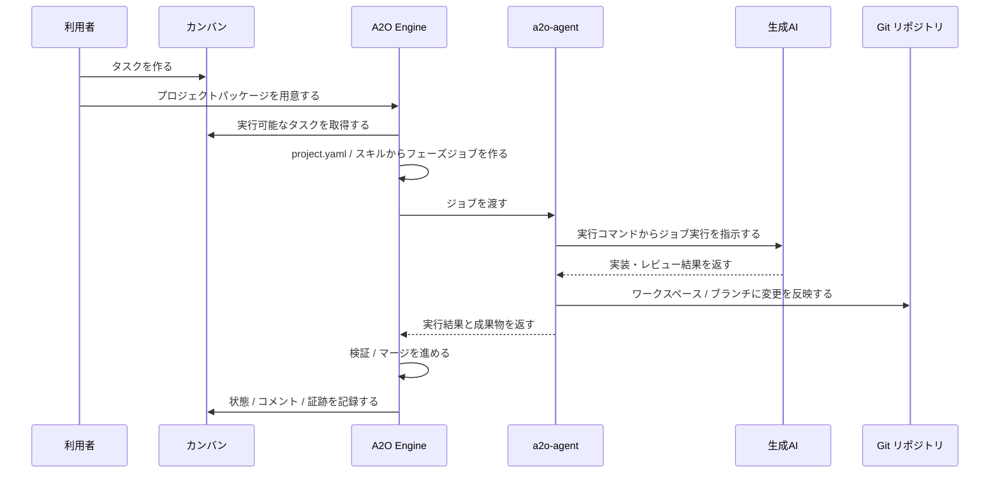

# A2O の概要

この文書は、A2O が何を実現し、利用者・プロジェクトパッケージ・カンバン・A2O Engine・a2o-agent・生成AI・Git リポジトリがどうつながるかを説明する。

## A2O が実現すること

A2O はカンバンタスクを起点に、AI による実装、検証、マージ、証跡記録までを一連のランタイム処理として扱う。

## 入力、処理、出力

| 観点 | 内容 |
|---|---|
| 利用者が用意するもの | Git リポジトリ、プロジェクトパッケージ、AI 用スキル、検証 / 修復コマンド、カンバンタスク |
| A2O が読むもの | `project.yaml`、カンバンタスク、スキルファイル、ランタイム状態 |
| A2O が進めるもの | スケジューラ、フェーズごとのジョブ、エージェントジョブ、検証、マージ、証跡記録 |
| エージェントが実行するもの | 実行コマンド、プロダクトのツールチェーン、生成AI呼び出し |
| 結果が残る場所 | Git ブランチ / マージ結果、カンバンコメント / 状態、証跡、エージェント成果物 |

## 通常実行の流れ

Git 操作の実行場所はフェーズとワークスペースによって異なる。利用者が意識する成果物は、Git リポジトリのブランチ / マージ結果、カンバンの状態 / コメント、A2O の証跡である。

## 責務分担

| 要素 | 責務 | 利用者が意識すること |
|---|---|---|
| カンバン | タスクキューと利用者から見える状態 | タスクを作る、状態を見る |
| プロジェクトパッケージ | プロダクト固有の入力 | リポジトリ、スキル、コマンド、検証方法を宣言する |
| A2O Engine | 実行の進行管理 | スケジューラとフェーズ進行を任せる |
| a2o-agent | プロダクト環境での実行 | ツールチェーンと AI 実行コマンドを使える状態にする |
| 生成AI | 実装・レビュー補助 | スキルとタスクに従って作業する |
| Git リポジトリ | 成果物 | ブランチ / マージ結果を確認する |

この流れを理解してからクイックスタートを読むと、各コマンドの意味が追いやすくなる。

## 登場要素の関係

`project.yaml` は A2O に「どのボードを見るか」「どのリポジトリを扱うか」「どのフェーズでどのコマンド / スキルを使うか」を教える。

AI 用スキルファイルは、実行コマンドに渡す作業方針である。A2O Engine はスキルを直接実行するのではなく、フェーズジョブの材料として扱う。

カンバンは作業キューであり、利用者から見える状態管理の場所である。A2O Engine はカンバンからタスクを取り出し、進捗や判断結果をカンバンに返す。

`a2o-agent` はプロダクト環境側の実行役である。A2O Engine はコンテナ内で進行管理を担当し、プロダクト固有コマンドはエージェント側で動く。

Git リポジトリは最終成果物の置き場である。A2O はブランチ名前空間とマージフェーズを通じて、AI 実行結果を Git の変更として扱う。

## 読み進め方

最初は次の順で読む。

1. [10-quickstart.md](10-quickstart.md): 最小手順で起動する。
2. [20-project-package.md](20-project-package.md): 利用者が管理する入力を理解する。
3. [30-operating-runtime.md](30-operating-runtime.md): スケジューラ、エージェント、カンバン、ランタイムイメージを運用する。
4. [40-troubleshooting.md](40-troubleshooting.md): ブロック時や失敗時にどこを見るかを確認する。

詳細なスキーマや内部互換名は、リファレンスとして後から読む。
