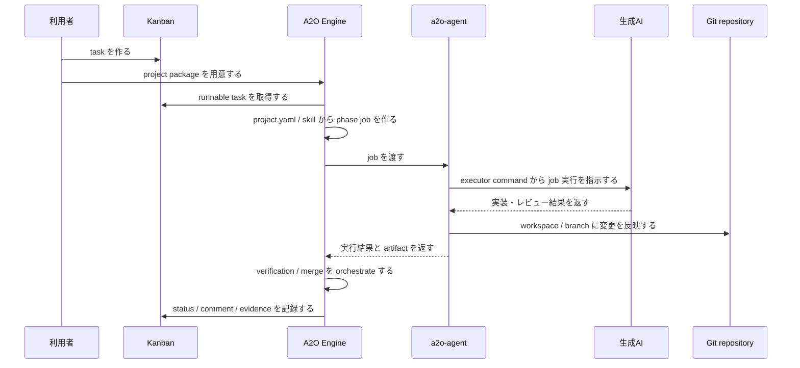

# A2O Overview

この文書は、A2O が何を実現し、利用者・project package・kanban・A2O Engine・a2o-agent・生成AI・Git repository がどうつながるかを説明する。

## A2O が実現すること

A2O は kanban task を起点に、AI による実装、検証、merge、evidence 記録までを一連の runtime flow として扱う。

## 入力、処理、出力

| 観点 | 内容 |
|---|---|
| 利用者が用意するもの | Git repository、project package、AI 用 skill、verification / remediation commands、kanban task |
| A2O が読むもの | `project.yaml`、kanban task、skill files、runtime state |
| A2O が進めるもの | scheduler、phase job、agent job、verification、merge、evidence recording |
| Agent が実行するもの | executor command、product toolchain、生成AI呼び出し |
| 結果が残る場所 | Git branch / merge result、kanban comment / status、evidence、agent artifact |

## 通常実行の流れ

Git 操作の実行場所は phase と workspace によって異なる。利用者が意識する成果物は、Git repository の branch / merge result、kanban の status / comment、A2O evidence である。

## 責務分担

| 要素 | 責務 | 利用者が意識すること |
|---|---|---|
| Kanban | task queue と visible state | task を作る、状態を見る |
| Project package | product 固有の入力 | repo、skill、command、verification を宣言する |
| A2O Engine | orchestration | scheduler と phase 進行を任せる |
| a2o-agent | product 環境での実行 | toolchain と AI executor を使える状態にする |
| 生成AI | 実装・レビュー補助 | skill と task に従って作業する |
| Git repository | 成果物 | branch / merge result を確認する |

この流れを理解してから quickstart を読むと、各 command の意味が追いやすくなる。

## 登場要素の関係

`project.yaml` は A2O に「どの board を見るか」「どの repository を扱うか」「どの phase でどの command / skill を使うか」を教える。

AI 用 skill files は executor に渡す作業方針である。A2O Engine は skill を直接実行するのではなく、phase job の材料として扱う。

Kanban は作業 queue であり、利用者から見える状態管理の場所である。A2O Engine は kanban から task を取り出し、進捗や判断結果を kanban に返す。

`a2o-agent` は product 環境側の実行役である。A2O Engine は container 内で orchestration を担当し、product 固有 command は agent 側で動く。

Git repository は最終成果物の置き場である。A2O は branch namespace と merge phase を通じて、AI 実行結果を Git の変更として扱う。

## 読み進め方

最初は次の順で読む。

1. [10-quickstart.md](10-quickstart.md): 最小手順で起動する。
2. [20-project-package.md](20-project-package.md): 利用者が管理する入力を理解する。
3. [30-operating-runtime.md](30-operating-runtime.md): scheduler、agent、kanban、runtime image を運用する。
4. [40-troubleshooting.md](40-troubleshooting.md): blocked / failed 時にどこを見るかを確認する。

詳細な schema や内部互換名は reference として後から読む。
