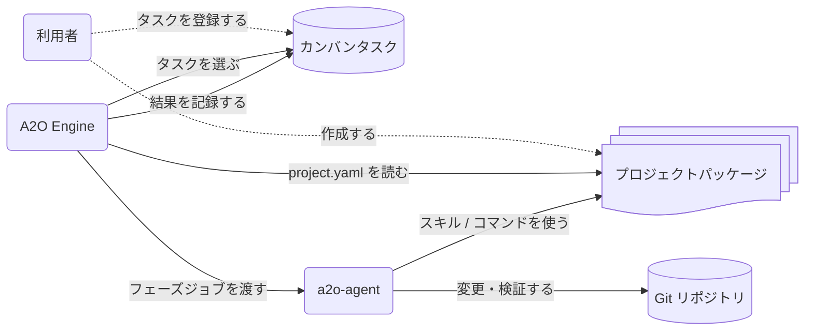

# プロジェクトパッケージ

プロジェクトパッケージは、A2O に「このプロダクトをどう扱えばよいか」を渡す入力である。A2O Engine はカンバンタスクを見つけ、ワークスペースを用意し、フェーズを進める。プロジェクトパッケージは、そのときに必要なプロダクト固有の設定、AI への指示、検証コマンド、タスクの型を渡す。

この文書は、パッケージに何を置き、それが A2O のどこで使われるかを説明する。`project.yaml` の全項目は [90-project-package-schema.md](90-project-package-schema.md) を参照する。

## 何を入力するか

プロジェクトパッケージは、次の 4 種類の入力を 1 つのディレクトリにまとめる。

| 入力 | 役割 | A2O が使うタイミング |
| --- | --- | --- |
| `project.yaml` | パッケージ名、カンバンプロジェクト、リポジトリスロット、フェーズ、実行コマンド、検証コマンドを定義する | 初期化、カンバン起動、ランタイム実行 |
| `skills/` | AI ワーカーに渡すプロダクト固有の判断基準を書く | 実装、レビュー、親タスクレビュー |
| `commands/` | ビルド、テスト、検証、修復、ワーカー用コマンドを置く | フェーズ実行、検証、修復 |
| `task-templates/` | 人間がカンバンタスクを作るときの型を置く | タスク作成時の参考 |

A2O はプロダクトの方針をソースコードから自動推測しない。リポジトリの境界、使うコマンド、AI に守らせるルール、検証方法はプロジェクトパッケージに明示する。

## 実行時のつながり



利用者が管理するものはプロジェクトパッケージとカンバンタスクである。A2O Engine は `project.yaml` を読んで、どのカンバンを見るか、どのリポジトリを扱うか、各フェーズで何を実行するかを決める。a2o-agent は Engine から渡されたジョブを実行し、パッケージ内のスキルとコマンドを使って Git リポジトリを変更・検証する。

## 推奨レイアウト

```text
project-package/
  README.md
  project.yaml
  commands/
  skills/
    implementation/
    review/
  task-templates/
  tests/
    fixtures/
```

`project.yaml` は唯一の公開パッケージ設定である。`manifest.yml` や `kanban/bootstrap.json` のような別設定ファイルを利用者に管理させない。

`commands/` には、ランタイムフェーズから呼ばれてよいプロジェクト管理のスクリプトを置く。本番用コマンドとテスト用フィクスチャは混ぜない。

`skills/` には AI ワーカーに渡すルールを置く。スキルは短く、具体的に書く。リポジトリの境界、編集してよいパス、レビュー観点、残すべき証跡など、AI が安全に推測できない判断を明記する。

`task-templates/` には人間がタスクを作るときのテンプレートを置く。A2O はテンプレートを自動投入しない。実行対象はカンバンに登録されたタスクである。

`tests/fixtures/` にはパッケージ検証用のフィクスチャや、結果が決まっているテスト用ワーカーを置く。通常運用のランタイムフェーズからフィクスチャを呼ばない。

## project.yaml の役割

`project.yaml` は、A2O がランタイムインスタンスを作り、タスクを選び、フェーズを実行するための入口である。

```yaml
schema_version: 1

package:
  name: my-product

kanban:
  project: MyProduct
  selection:
    status: To do

repos:
  app:
    path: ..
    role: product
    label: repo:app

agent:
  workspace_root: .work/a2o/agent/workspaces
  required_bins:
    - git
    - node
    - npm
    - your-ai-worker

runtime:
  max_steps: 20
  agent_attempts: 200
  phases:
    implementation:
      skill: skills/implementation/base.md
      executor:
        command: [your-ai-worker, --schema, "{{schema_path}}", --result, "{{result_path}}"]
    review:
      skill: skills/review/default.md
      executor:
        command: [your-ai-worker, --schema, "{{schema_path}}", --result, "{{result_path}}"]
    verification:
      commands:
        - app/project-package/commands/verify.sh
    remediation:
      commands:
        - app/project-package/commands/format.sh
    merge:
      policy: ff_only
      target_ref: refs/heads/main
```

各 section の考え方は次の通りである。

| section | 利用者が決めること | A2O がそれを使う場所 |
| --- | --- | --- |
| `package` | パッケージの識別子 | ブランチ / 参照、ワークスペース、診断 |
| `kanban` | 対象プロジェクトとタスク選択 | タスクの取得、ボードの準備 |
| `repos` | リポジトリスロット、パス、カンバンラベル | ワークスペース準備、リポジトリ単位のタスク |
| `agent` | ホスト側に必要なコマンド | エージェント配置、事前診断 |
| `runtime.phases` | フェーズごとのスキル、実行コマンド、検証コマンド | 実装、レビュー、検証、修復、マージ |

A2O が管理するレーンや内部ラベルは書かない。`a2o kanban up` が必要なレーンと内部ラベルを用意する。

## スキルの書き方

スキルは AI ワーカーに渡すプロダクト固有の指示である。一般論ではなく、このプロダクトで守るべき判断を書く。

実装用スキルに書くこと:

- 変更してよいリポジトリとパス
- コーディングルール
- 実装後に必要な検証
- タスクコメントや証跡に残すべき情報
- プロジェクト固有の知識検索コマンドを使う条件

レビュー用スキルに書くこと:

- 指摘事項とみなす条件
- 公開 API、SPI、互換性、ドキュメントの確認観点
- 必須の検証証跡
- 残リスクの書き方

親タスクレビュー用スキルに書くこと:

- 子タスクの成果をどう統合して見るか
- 複数リポジトリ統合の確認観点
- マージ前に必要な証跡

スキルは、運用チームが実際に保守できる言語で書く。日本語で運用するプロダクトなら日本語でよい。

## コマンドの書き方

コマンドは、A2O がフェーズ中に呼ぶプロダクト管理の実行ファイルである。A2O の内部ファイルではなく、公開されているプレースホルダーと環境変数を使う。

ワーカーコマンドは要求データ一式を標準入力で受け取り、結果 JSON を `{{result_path}}` に書く。

```yaml
runtime:
  phases:
    implementation:
      skill: skills/implementation/base.md
      executor:
        command:
          - your-ai-worker
          - "--schema"
          - "{{schema_path}}"
          - "--result"
          - "{{result_path}}"
```

検証コマンドはタスク結果を証明する。修復コマンドは再検証の前に、整形や生成ファイル更新など、プロジェクトが認めた保守的な修復だけを行う。

良いコマンドの条件:

- 同じ入力なら同じ結果になる
- 失敗理由と対象リポジトリ / パスが分かる
- 隠れたグローバル依存を避ける
- commit、push、カンバン状態の編集をしない
- private な `.a3` metadata や生成された launcher file を読まない

コマンドがタスク種別やリポジトリスロットによって変わる場合だけ、`project.yaml` の variants を使う。単純なパッケージでは既定のコマンドを優先する。

## タスクテンプレートの位置づけ

タスクテンプレートは、人間がカンバンタスクを作るときの入力例である。ランタイムがタスクテンプレートを読んで自動実行するわけではない。

テンプレートには、A2O がタスクを正しく解釈するための情報を含める。

- 目的
- 対象リポジトリラベル
- 期待する変更
- 完了条件
- 検証観点
- 制約や触ってはいけない範囲

複数リポジトリの親タスクでは、対象リポジトリラベルをすべてタスクに付ける。`all` や `both` のような合成ラベルではなく、実際のリポジトリスロットに対応するラベルを使う。

## 通常設定とテスト用フィクスチャを分ける

`project.yaml` は通常運用用に保つ。本番運用の実装 / レビューフェーズから、結果が決まっているテスト用ワーカーを呼ばない。

パッケージが検証用プロファイルを必要とする場合は、明示的に分ける。

- `project-test.yaml` のような別設定を使う。
- フィクスチャ用ワーカーは `tests/fixtures/` 配下に置く。
- フィクスチャ用コマンドは本番用コマンドと間違えない名前にする。
- 検証用プロファイルの実行方法をドキュメントに書く。

別プロファイルは、使うときに明示する。

```sh
a2o project validate --package ./project-package --config project-test.yaml
a2o runtime run-once --project-config project-test.yaml
```

## 作成と確認

新規パッケージはテンプレートから始める。

```sh
a2o project template \
  --package-name my-product \
  --kanban-project MyProduct \
  --language node \
  --executor-bin your-ai-worker \
  --with-skills \
  --output ./project-package/project.yaml
```

生成後に `your-ai-worker`、検証コマンド、スキルの中身をプロダクトに合わせて変更する。

パッケージをランタイムに使う前に確認する。

```sh
a2o project lint --package ./project-package
```

`blocked` の指摘は実行前に直す。スキーマの詳細、プレースホルダー、variants の細かな仕様は [90-project-package-schema.md](90-project-package-schema.md) を参照する。

## レビュー観点

実際のタスクに使う前に、次を確認する。

- `project.yaml` が唯一の公開設定ファイルになっている。
- `a2o project lint --package ./project-package` に `blocked` の指摘がない。
- A2O が管理するレーンと内部ラベルを手書きしていない。
- `agent.required_bins` にプロダクトのツールチェーンとワーカー実行ファイルが含まれている。
- 本番運用のフェーズが `tests/fixtures/` を呼んでいない。
- 検証コマンドが失敗理由と対象範囲を出す。
- 修復コマンドが広範な予期しない変更を起こさない。
- スキルにリポジトリ境界、レビュー基準、必要な証跡が書かれている。
- 生成ファイルが `.work/a2o/` 配下に閉じている。
- 利用者向けドキュメントとコマンドが A2O 名を使っている。
