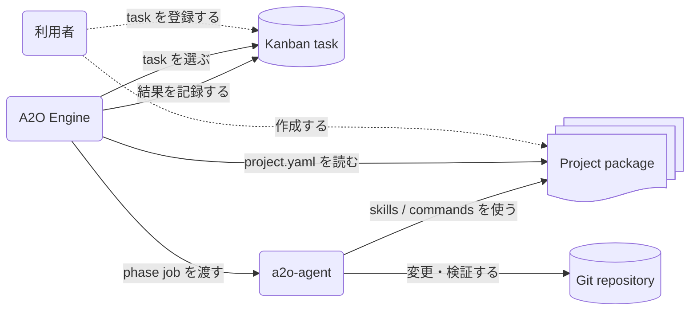

# Project Package

Project package は、A2O に「この product をどう扱えばよいか」を渡す入力である。A2O Engine は kanban task を見つけ、workspace を用意し、phase を進める。Project package は、そのときに必要な product 固有の設定、AI への指示、検証 command、task の型を渡す。

この文書は、package に何を置き、それが A2O のどこで使われるかを説明する。`project.yaml` の全 field は [90-project-package-schema.md](90-project-package-schema.md) を参照する。

## 何を入力するか

Project package は、次の 4 種類の入力を 1 つの directory にまとめる。

| 入力 | 役割 | A2O が使うタイミング |
| --- | --- | --- |
| `project.yaml` | package 名、kanban project、repo slot、phase、executor、検証 command を定義する | bootstrap、kanban 起動、runtime 実行 |
| `skills/` | AI worker に渡す product 固有の判断基準を書く | implementation、review、parent review |
| `commands/` | build、test、verification、remediation、worker command を置く | phase 実行、検証、修復 |
| `task-templates/` | 人間が kanban task を作るときの型を置く | task 作成時の参考 |

A2O は product policy を source code から自動推測しない。Repository の境界、使う command、AI に守らせる rule、検証方法は project package に明示する。

## 実行時のつながり



利用者が管理するものは project package と kanban task である。A2O Engine は `project.yaml` を読んで、どの kanban を見るか、どの repo を扱うか、各 phase で何を実行するかを決める。a2o-agent は Engine から渡された job を実行し、package 内の skill と command を使って Git repository を変更・検証する。

## 推奨 layout

```text
project-package/
  README.md
  project.yaml
  commands/
  skills/
    implementation/
    review/
  task-templates/
  tests/
    fixtures/
```

`project.yaml` は唯一の公開 package config である。`manifest.yml` や `kanban/bootstrap.json` のような別設定 file を利用者に管理させない。

`commands/` には runtime phase から呼ばれてよい project-owned script を置く。Production command と test fixture は混ぜない。

`skills/` には AI worker に渡す rule を置く。Skill は短く、具体的に書く。Repository boundary、編集してよい path、review 観点、evidence expectation など、AI が安全に推測できない判断を明記する。

`task-templates/` には人間が task を作るときの template を置く。A2O は template を自動投入しない。実行対象は kanban に登録された task である。

`tests/fixtures/` には package validation fixture や deterministic worker を置く。通常運用の runtime phase から fixture を呼ばない。

## project.yaml の役割

`project.yaml` は、A2O が runtime instance を作り、task を選び、phase を実行するための入口である。

```yaml
schema_version: 1

package:
  name: my-product

kanban:
  project: MyProduct
  selection:
    status: To do

repos:
  app:
    path: ..
    role: product
    label: repo:app

agent:
  workspace_root: .work/a2o/agent/workspaces
  required_bins:
    - git
    - node
    - npm
    - your-ai-worker

runtime:
  max_steps: 20
  agent_attempts: 200
  phases:
    implementation:
      skill: skills/implementation/base.md
      executor:
        command: [your-ai-worker, --schema, "{{schema_path}}", --result, "{{result_path}}"]
    review:
      skill: skills/review/default.md
      executor:
        command: [your-ai-worker, --schema, "{{schema_path}}", --result, "{{result_path}}"]
    verification:
      commands:
        - app/project-package/commands/verify.sh
    remediation:
      commands:
        - app/project-package/commands/format.sh
    merge:
      policy: ff_only
      target_ref: refs/heads/main
```

各 section の考え方は次の通りである。

| section | 利用者が決めること | A2O がそれを使う場所 |
| --- | --- | --- |
| `package` | package identity | branch/ref、workspace、diagnostics |
| `kanban` | 対象 project と task selection | task polling、board provisioning |
| `repos` | repo slot、path、kanban label | workspace preparation、repo-scoped task |
| `agent` | host 側に必要な command | agent install、preflight diagnosis |
| `runtime.phases` | phase ごとの skill、executor、検証 command | implementation、review、verification、remediation、merge |

A2O-owned lane や internal label は書かない。`a2o kanban up` が必要な lane と internal label を用意する。

## Skill の書き方

Skill は AI worker に渡す product 固有の instruction である。一般論ではなく、この product で守るべき判断を書く。

Implementation skill に書くこと:

- 変更してよい repository と path
- coding rule
- 実装後に必要な verification
- task comment や evidence に残すべき情報
- project knowledge command を使う条件

Review skill に書くこと:

- finding とみなす条件
- public API、SPI、compatibility、documentation の確認観点
- 必須の verification evidence
- residual risk の書き方

Parent review skill に書くこと:

- child task の成果をどう統合して見るか
- multi-repo integration の確認観点
- merge 前に必要な evidence

Skill は、運用チームが実際に保守できる言語で書く。日本語で運用する product なら日本語でよい。

## Command の書き方

Command は A2O が phase 中に呼ぶ product-owned executable である。A2O の内部 file ではなく、公開 placeholder と environment variables を使う。

Worker command は request bundle を stdin で受け取り、result JSON を `{{result_path}}` に書く。

```yaml
runtime:
  phases:
    implementation:
      skill: skills/implementation/base.md
      executor:
        command:
          - your-ai-worker
          - "--schema"
          - "{{schema_path}}"
          - "--result"
          - "{{result_path}}"
```

Verification command は task result を証明する。Remediation command は verification retry の前に format や generated file 更新など、project が認めた保守的な修復だけを行う。

良い command の条件:

- deterministic に動く
- failure reason と対象 repo/path が分かる
- hidden global dependency を避ける
- commit、push、kanban state 編集をしない
- private `.a3` metadata や generated launcher file を読まない

Command が task kind や repo slot によって変わる場合だけ、`project.yaml` の variants を使う。単純な package では default command を優先する。

## Task template の位置づけ

Task template は、人間が kanban task を作るときの入力例である。Runtime が task template を読んで自動実行するわけではない。

Template には、A2O が task を正しく解釈するための情報を含める。

- 目的
- 対象 repo label
- 期待する変更
- 完了条件
- 検証観点
- 制約や触ってはいけない範囲

Multi-repo の parent task では、対象 repo label をすべて task に付ける。`all` や `both` のような合成 label ではなく、実 repo slot に対応する label を使う。

## 通常 config と test fixture を分ける

`project.yaml` は通常運用用に保つ。Production の implementation / review phase から deterministic fixture worker を呼ばない。

Package が test profile を必要とする場合は、明示的に分ける。

- `project-test.yaml` のような別 config を使う。
- fixture worker は `tests/fixtures/` 配下に置く。
- fixture command は production command と間違えない名前にする。
- test profile の実行方法を docs に書く。

Alternate profile は、使うときに明示する。

```sh
a2o project validate --package ./project-package --config project-test.yaml
a2o runtime run-once --project-config project-test.yaml
```

## 作成と確認

新規 package は template から始める。

```sh
a2o project template \
  --package-name my-product \
  --kanban-project MyProduct \
  --language node \
  --executor-bin your-ai-worker \
  --with-skills \
  --output ./project-package/project.yaml
```

生成後に `your-ai-worker`、verification command、skill の中身を product に合わせて変更する。

Package を runtime に使う前に確認する。

```sh
a2o project lint --package ./project-package
```

`blocked` finding は実行前に直す。Schema の詳細、placeholder、variants の細かな仕様は [90-project-package-schema.md](90-project-package-schema.md) を参照する。

## Review checklist

実 task に使う前に、次を確認する。

- `project.yaml` が唯一の公開 config file になっている。
- `a2o project lint --package ./project-package` に blocked finding がない。
- A2O-owned lane と internal label を手書きしていない。
- `agent.required_bins` に product toolchain と worker executable が含まれている。
- Production phase が `tests/fixtures/` を呼んでいない。
- Verification command が失敗理由と対象 scope を出す。
- Remediation command が広範な予期しない変更を起こさない。
- Skill に repo boundary、review criteria、evidence expectation が書かれている。
- Generated files が `.work/a2o/` 配下に閉じている。
- 利用者向け docs と commands が A2O 名を使っている。
